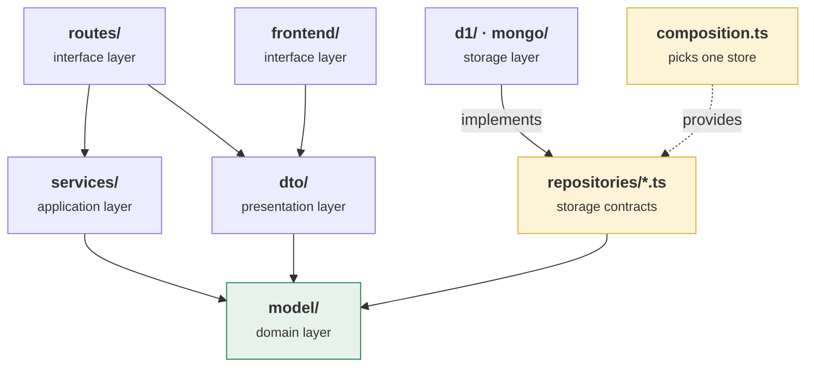

# DDD building blocks

This page is a **mapping, not a rule book**. It names which Domain-Driven Design
archetype each concept in FantasyWiki was modelled as, and which module holds
it. Every rule it refers to is stated once elsewhere, under `domain/` in
[the documentation index](../README.md), and linked from here.

It exists because the codebase applies the archetypes without naming them. The
repository interface with one implementation per store is an anti-corruption
layer; the import rule that keeps services away from those implementations is
layering enforced in the build. Both were built for their own reasons and are
documented under those reasons. A reader who arrives looking for the vocabulary
finds the practice and not the word, so this page supplies the word and points at
the practice.

The model also has a perimeter, and the perimeter is a design decision like any
other. [Scope of the model](#scope-of-the-model) names the archetypes the domain
did not call for, and the constraint that made each one unnecessary.

## The Ubiquitous Language is `CONTEXT.md`

[`CONTEXT.md`](../../CONTEXT.md) is the glossary. It is what the code names its
types after, what a commit message says, and what these documents call the
thing.

Two of its conventions are doing DDD work:

- **Each entry carries an `_Avoid_` list** of the near-misses the term exists to
  displace: *Top Read Snapshot* avoids "live ranking", *Normalized Views* avoids
  "adjusted views". A synonym that has been written down and rejected cannot
  quietly come back as a second name for one concept.
- **`_Core_.` marks the terms nothing else can be read without.** Those are the
  terms the single-document exam report carries, so a reader going straight
  through it meets the vocabulary it is written in rather than the whole
  ingestion pipeline.

The glossary is the artefact, and the discipline is that a term is added there
before it is added to a type name. A word that appears in code and not in
`CONTEXT.md` is the failure this arrangement prevents.

## Which archetype each concept became

| Concept | Archetype | Lives in |
|---|---|---|
| **League** | Aggregate Root | `model/league.ts`, `leagueRepository.ts` |
| **Team** | Aggregate Root | `model/team.ts`, `teamRepository.ts` |
| **Contract** | Entity, inside the Team aggregate | `model/contract.ts`, `contractRepository.ts` |
| **Player** | Entity | `model/player.ts`, `playerRepository.ts` |
| **Lineup** / **Formation** | Entity, inside the Team aggregate | `model/lineup.ts`, `model/formation.ts` |
| **Contract Term** | Value Object | `model/contract.ts` |
| **Chemistry Link**, **Chemistry Level** | Value Object | `model/enums.ts` |
| **Language Scale Factor** | Value Object | `model/languageScale.ts` |
| **Performance** | Value Object | `model/performances.ts` |
| **Article Availability** | Value Object | `model/contract.ts` |
| **Top Read Entry** | Value Object | `external-apis/wikimedia/wikimedia.ts` |
| **Invitation Code** | Value Object | `model/league.ts`, as a validated `string` |
| **Notification** | Domain Event notification | `model/notification.ts`, `notificationRepository.ts` |
| Every business operation | Service | `backend/src/services/` |
| Every persistence contract | Repository | `backend/src/repositories/*.ts` |

## Entity or Value Object

The discriminator is **identity, not shape**. Both model elementary concepts;
what separates them is whether the domain distinguishes one instance from
another. A Contract is an Entity because two contracts on the same article at
the same price are still two contracts. A Contract Term is a Value Object
because two windows over the same dates are the same window.

The consequences are visible in `model/`:

- **Value Objects are immutable and compared by attribute.** `ContractTerm` is
  read-only, and every lifecycle question about it is a pure function over it,
  `termDays`, `remainingDays`, `isActive`, `isExpired`. None of them mutates.
- **Entities are compared by identity and may hold mutable state.** A `Contract`
  carries `settled`, `renewalCount` and `renewalElected`, all of which change
  over its life while its `id` does not.

**Identifiers are strings, and that is a deliberate boundary.** DDD can model an
Entity's identifier as a Value Object of its own, so the type system tells a team
identifier from an article identifier. In `model/` every identifier is a bare
`string`:

```ts
export interface Contract {
  id: string;
  teamId: string;
  articleId: string;
  // ...
}
```

The trade is a known one. Branded types in `model/` would make the compiler the
enforcer, at the cost of a wrapper on every identifier crossing the DTO and
persistence boundaries — where the value has to be a plain `string` again. With
one bounded context and one team, the mix-up that branding prevents has not
happened; the upgrade path stays open because the identifiers are already
centralised in `model/`.

## Aggregates, and the one reference they may hold

Components of one aggregate do not hold references to components of another.
The exception is a reference to the other aggregate's **identifier**, and it is
the exception FantasyWiki relies on: a `Team` holds a `leagueId`, not a
`League`. Expanding that identifier into a nested object is the DTO layer's job,
never the model's. This is stated in
[What Are Model Entities](../domain/what-are-model-entities.md) and
[Shared DTO Package](../domain/shared-dto-package.md).

An aggregate root also guarantees the consistency of what it contains, and the
Team aggregate's core invariant is its credit balance.
[ADR 0007](../adr/0007-derived-team-credits.md) records where that invariant is
enforced and why the placement looks wrong: the principle says the invariant
belongs to the aggregate, and the purchase check lives in the `INSERT` instead,
because the reading-then-writing alternative is not merely less tidy but
incorrect under concurrent buys. Read that ADR before moving the check.

## The repository layer is an anti-corruption layer

Of the four model-integrity patterns, the one FantasyWiki implements is the
**anti-corruption layer**, and the upstream it defends against is the store.

`backend/src/repositories/*.ts` holds contracts expressed in domain terms.
Underneath, `repositories/d1/` speaks SQL and `repositories/mongo/` speaks
documents, pipelines and transactions. A store's own error wording never leaves
the layer. `composition.ts` is the only module that names an implementation, and
the boundary is enforced mechanically rather than by convention:
`no-restricted-imports` forbids anything under `services/`, `routes/` or
`tests/` from naming `repositories/d1/**` or `repositories/mongo/**`.

That an anti-corruption layer exists is a claim; that this one holds is a
measurement. MongoDB was added without a change above the repository layer, and
the conformance suite the first target passed became the second's acceptance
criteria unchanged. See
[Persistence Targets](./persistence-targets.md).

`composition.ts` is also the codebase's one **Factory** in the DDD sense:
`repositoriesFor(env)` selects the adequate implementation dynamically while
hiding the choice from every caller.

**There is a second anti-corruption layer, against a different kind of
upstream.** The store is a technology chosen by this project; the Wikimedia APIs
are a web service nobody here controls, whose response shapes can change without
notice. `external-apis/wikimedia/` is the boundary: raw API rows arrive as
`WikimediaTopReadArticle` and leave as `TopReadEntry`, a Value Object named in
the Ubiquitous Language, and no caller sees the shape in between. That the layer
is shared by the Worker and the browser is what makes it one boundary rather
than two that drift. See
[Wikimedia Client Architecture](./wikimedia-client-architecture.md).

## The layers, and what enforces them

The hexagonal arrangement is that outer layers depend on inner ones and never
the reverse. FantasyWiki's modules map onto it as follows, with the domain layer
at the centre because `model/` imports nothing from a framework and so a Worker
and a browser can both use it.



Two things make this more than a drawing:

- **The layers are packaging units**, not folders by naming convention. `model/`
  and `dto/` are separate packages both the Worker and the SPA depend on, and
  `scoring-collector/` is a JVM module that shares neither: it is given an HTTP
  contract and a bearer secret, and that is all it is allowed to know.
- **The one dependency direction that matters is checked by a lint rule.**
  See [Backend Architecture](./backend-architecture.md) for the layer
  responsibilities and what each is forbidden from doing.

## Scope of the model

An archetype is a tool for a pressure. Naming the pressures this domain does not
have is what makes the archetypes it *does* use load-bearing rather than
decorative, so each of these is a decision with the constraint that settled it.

- **Factories stay at `repositoriesFor(env)`.** Domain objects are constructed
  from plain object literals and validated by predicate functions such as
  `isSchema` and `isLeagueDuration`. Creation is total and cheap: there is no
  multi-step assembly to encapsulate, so an encapsulating type would add a layer
  without removing one.
- **Domain events are reified, not propagated.** `Notification` is a domain
  event made durable, written by the service that causes it. Publish-subscribe
  earns its cost when the producer must not know its consumers; here there is one
  consumer, the player reading their notifications, so the broker would be
  infrastructure with nothing to route. What a notification may and may not do is
  in [Notifications](./notifications.md).
- **State is current state, with one ledger.** The contracts ledger is the
  exception, and it is the one place the sourcing property is worth its cost: a
  team's credit balance is derived on every read rather than stored, so it cannot
  disagree with the transactions that produced it
  ([ADR 0007](../adr/0007-derived-team-credits.md)). Everywhere else a snapshot
  answers every question asked of it.
- **Reads and writes share one path.** CQRS pays when the two have genuinely
  different shapes or load profiles. At a private league of friends they have
  neither, and one path means one place a rule can be wrong.
- **One bounded context, one team.** The three model-integrity patterns that
  describe relations *between* teams — shared kernel, customer-supplier,
  conformist — describe a situation this project does not have. The
  anti-corruption layer is the one that does apply, because its upstream is a
  technology and a third-party API rather than another team.

## Related

- [What Are Model Entities](../domain/what-are-model-entities.md)
- [Shared DTO Package](../domain/shared-dto-package.md)
- [Backend Architecture](./backend-architecture.md)
- [Persistence Targets](./persistence-targets.md)
- [ADR 0007: Team credits are derived](../adr/0007-derived-team-credits.md)
- [CONTEXT.md](../../CONTEXT.md), the Ubiquitous Language
