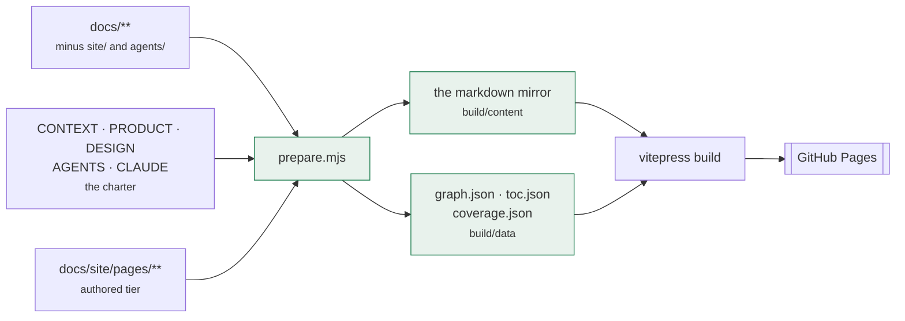
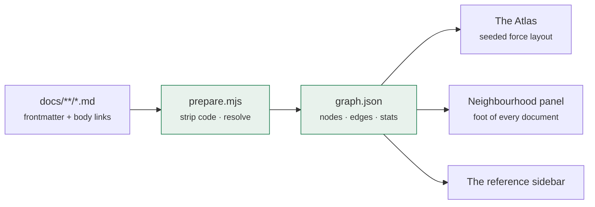
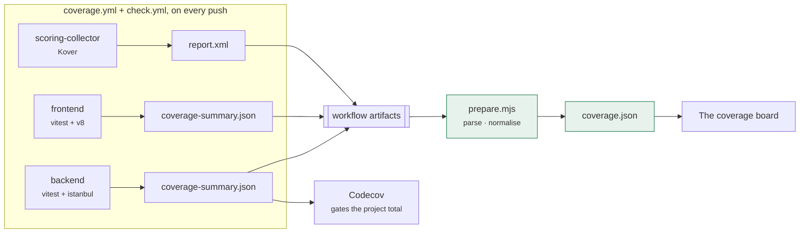
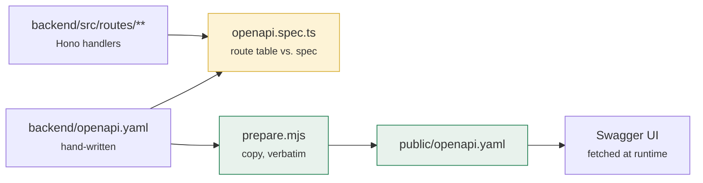
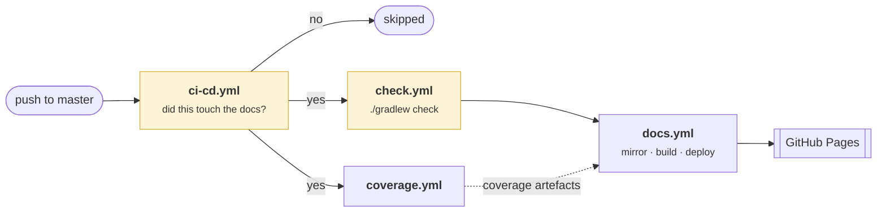

# About this site

The documentation is not written for this site. It is written in `docs/`, in the
repository, next to the code it describes, and this site is a view of it. That
constraint is the point: a page here cannot drift from the repository, because
there is no copy of it to drift.

Everything that follows is machinery. Nothing on this page is a rule about
FantasyWiki — the rules are in [`domain/`](./docs/), stated once each.

## Two tiers

| Tier | Written in | Holds |
|---|---|---|
| **Canonical** | `docs/**` and the repo-root charter files | Rules, decisions, conventions |
| **Authored** | `docs/site/pages/**` | Orientation, diagrams, cross-cutting views |

The canonical tier is mirrored here verbatim on every build, and its *Edit* links
point at the real file rather than at the copy. The authored tier — the landing
page, the architecture overview, the data flow, this page — exists only here, and
holds diagrams and orientation rather than rules.

The line between them is one question: **would the text still be needed by
someone reading the repository with no browser?** If yes, it is canonical. A
domain rule is therefore always canonical, always stated once, and always linked
to from everywhere else, which is what stops the site and the repository from
becoming two different specifications.

One corner of the canonical tier is deliberately not published:
`docs/agents/` is machine-read metadata, loaded by tooling from fixed paths, and
a page describing a triage label taxonomy is of no use to anyone reading here. It
stays in the repository, and links to it leave for GitHub like links to source
files do.

How a new feature gets documented — which tier, which section, and what has to be
updated by hand — is one of those files:
[`documentation-site.md`](https://github.com/FantasyWiki/FantasyWiki/blob/master/docs/agents/documentation-site.md).

## The mirror

`prepare.mjs` copies rather than transforms. The three things it does change are
the three that would otherwise break in a new location: `README.md` becomes
`index.md`, a link that points somewhere the site does not host — a source file,
or one of the agents files — becomes a GitHub blob URL, and each page gains
frontmatter recording where it came from. Links inside backticks are left alone, so the convention examples in
the documentation index survive being an example rather than a link.

The sidebar's reference section is derived from that same pass. A document added
to `docs/` appears in the navigation on the next build without anyone
remembering to come back and register it.

## Where the Atlas comes from

The documentation is a graph and always has been. Every document ends with a
`## Related` list, every rule is stated once and linked to from everywhere else,
and the result is a shape a folder of markdown cannot show you, because it can
only be read one file at a time.

Nothing about that picture is maintained by hand. `prepare.mjs` reads every
mirrored markdown file, strips its code blocks so a `[foo](bar)` inside a fenced
sample is not mistaken for a link, resolves every remaining relative target
against the tree, and writes the nodes and edges to a JSON file the page imports
at build time.

Because it is derived, it cannot describe a shape the tree no longer has, and it
costs nothing to keep current: a document added to `docs/` is a node on the next
publish, with whatever edges its links give it.

The layout is a small force simulation written for that one chart rather than a
graph library — repulsion between every pair, springs along the links, and a
gentle pull towards each section's own corner of the canvas. That last force is
the one that matters. An unseeded force layout of sixty densely linked nodes is
an unreadable ball of string; pinning each section to a quadrant is what turns it
into a map you can point at.

### The other half of the graph

The Atlas is the whole tree at once. The same data also appears one document at a
time: every page here ends with a **Neighbourhood** panel listing what it points
to *and what points at it*.

That second list is the one nobody can write by hand. A `## Related` section is
authored from one end of the edge; the reverse direction only exists once you
have read every other file. It is also the more useful half in practice — when
you are about to change a rule, what you need to know is who depends on it.

## Where the coverage numbers come from

The publish downloads the artefacts the test jobs already produced rather than
re-running the suites: the Workers-pool suite and the JVM build are the expensive
part of CI, and running them a second time to draw a bar chart would double the
cost of publishing a page.

A package whose report is missing from a build is shown as unmeasured rather than
as zero. An absent number and a bad number are different claims, and only one of
them is true when a job is skipped.

Because the site republishes only when the documentation changes, the board is
current as of the last publish rather than the last push — which is why it
carries the timestamp of the run it was measured on. A figure with a date on it
is honest; the same figure with an implied *now* is not.

## Where the API reference comes from

The [API reference](./api.md) is the one page here whose subject is not a
markdown file. It is Swagger UI over
[`backend/openapi.yaml`](https://github.com/FantasyWiki/FantasyWiki/blob/master/backend/openapi.yaml),
which lives next to the Worker it describes rather than under `docs/` — the
contract belongs with the code, and so does the test that gates it.

Written by hand, because there is nothing to generate it from: the routes are
plain handlers with no schema attached, and the shared types carry Temporal
values, which are classes in the code and strings on the wire. What keeps it
honest is the gate rather than a generator. `openapi.spec.ts` walks the Worker's
own mounted route table and fails in both directions — an endpoint the spec does
not describe, and an operation no endpoint serves — so a route added and not
written down breaks the build.

The copy is verbatim and the page fetches it at runtime, so what Swagger UI
renders is byte-for-byte the file in the repository, and
[`/openapi.yaml`](/openapi.yaml) is a usable answer for anything
that would rather read the document than the page.

The same pass counts the document — operations, paths, schemas, the split by
method and by authentication regime — into the board on the landing page. Those
figures are derived for the reason the coverage numbers are: a surface typed
into a page is a surface that will be wrong.

## How it is published

`docs.yml` is called from the dispatcher like the deploys are, behind the same
`check` gate, and refuses to run on anything but `master` — the documentation
describes production, and a QA copy of it would be a second URL nobody knows
which of to trust.

It runs only when the push touched something the site is built from: anything
under `docs/`, `backend/openapi.yaml`, one of the five charter files at the
repository root, or the two workflows that feed it. The dispatcher answers that with the compare API rather
than a checkout, and **anything it cannot answer counts as touched** — a first
push to a branch, a manual run, an API that failed. Publishing an unchanged site
costs two minutes; skipping a changed one ships stale documentation.

Two checks gate the build itself. **Dead-link detection** is the only automated
proof that the mirror rewrote every link correctly, so it stays on; a link that
breaks while the mirror is assembled fails the build instead of shipping a 404.
**The mermaid parser** runs every diagram through the same library the browser
will, because a diagram with a syntax error renders as an error box on the
published page and nowhere else.

What no build-time check can see is the fetch. Mermaid is a chunk of its own,
asked for the first time a figure draws, and a chunk that never arrives — a
dropped request, or a tab older than the publish that replaced it — takes every
diagram on the page down with it while the prose around them stays perfectly
readable. The page answers that itself: the first failed chunk reloads the tab
once, and a figure that still cannot draw prints the source it was given and
offers the reload.

## Related

- [`docs/agents/documentation-site.md`](https://github.com/FantasyWiki/FantasyWiki/blob/master/docs/agents/documentation-site.md) — the working agreement for keeping
  this current, on GitHub
- [Continuous delivery](./quality/ci-cd.md) — where `docs.yml` sits among the
  other workflows
- [`docs/agents/openapi-spec.md`](https://github.com/FantasyWiki/FantasyWiki/blob/master/docs/agents/openapi-spec.md) — why the API reference is written
  rather than derived, on GitHub
- [Documentation index](./docs/) — the canonical tier itself
