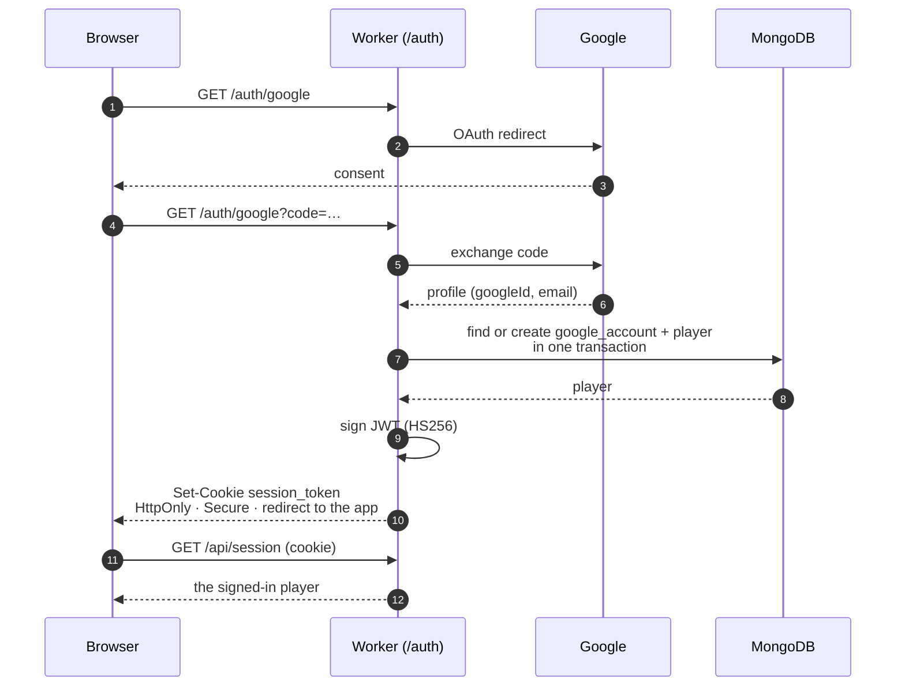
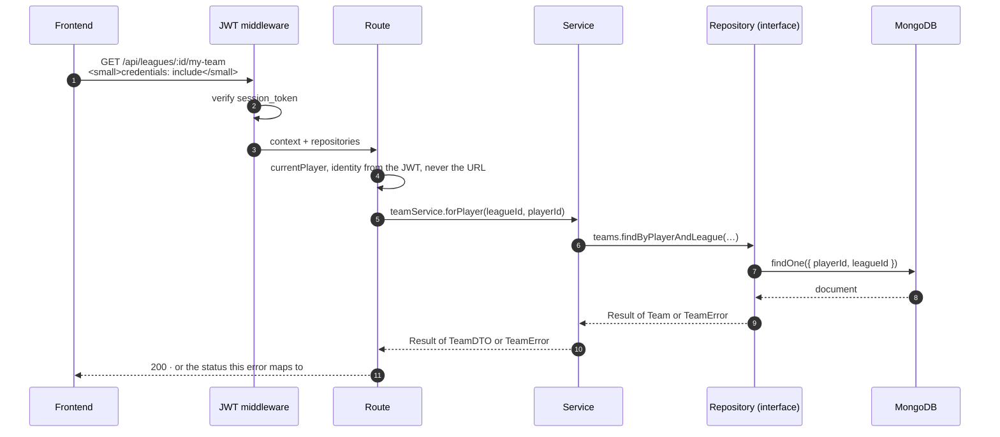
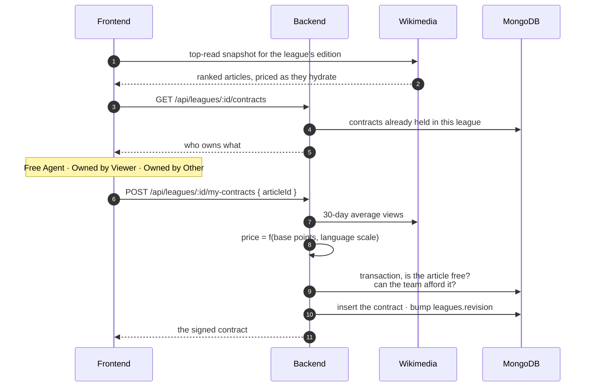
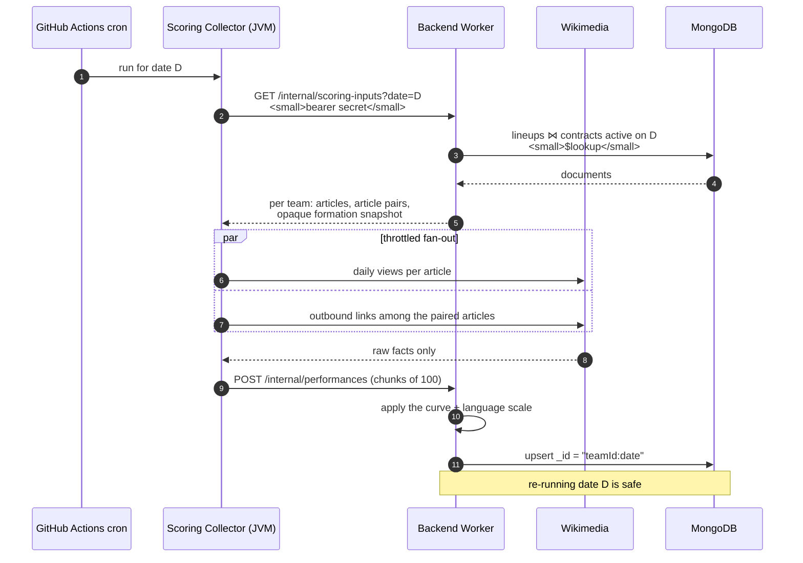
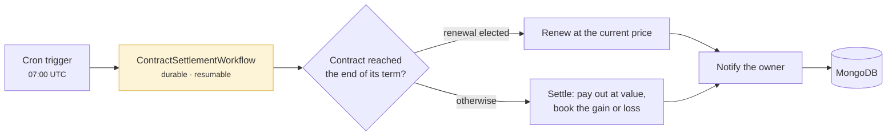
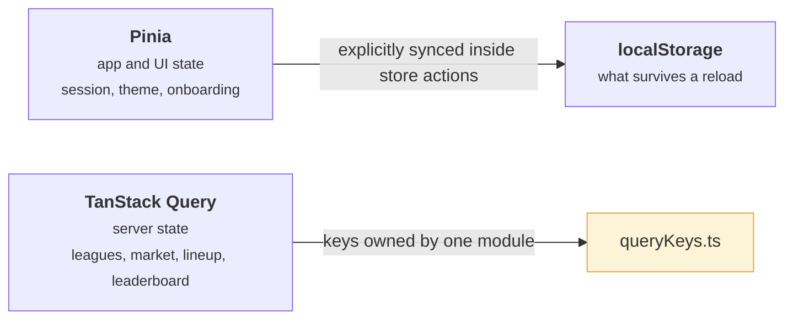

# Data flow

Five journeys through the system, in the order a reader meets them. Each one
stops at the seam where the detail is documented properly, and links there
rather than restating it.

## 1. Signing in

Identity is Google's; the session is a signed JWT in an HTTP-only cookie. The
frontend never holds a token in JavaScript, and never sends an `Authorization`
header, it sends `credentials: "include"` and the browser does the rest.

Everything under `/api/*` sits behind Hono's JWT middleware reading that cookie.
Two route groups sit deliberately *outside* it: `/auth/*`, which has no session
yet, and `/internal/*`, which is authenticated by a bearer service token instead
because its caller is a batch job, not a person.

The MongoDB build adds a second door, and only that build has it: a username
and a password, checked against a `password_credentials` document and answered
with the same signed cookie. Which build a deployment is comes down to which
entry module it names, so the Worker Cloudflare deploys does not contain the
handler at all, a route table is the wrong place to enforce that, and a test
fails if a password route ever reaches the deployed entry.
→ [Auth Modes](../docs/architecture/auth-modes.md)

The local environment adds one more door. `routes/devAuth.ts` mounts a sign-in
that produces an identical session with no Google round trip, and refuses to
work unless `ENVIRONMENT` is `local`, so a clone can be run by someone who has
no OAuth credentials to obtain.

→ [Local Development Setup](../docs/development/local-dev-setup.md) ·
[Running in Docker](../docs/development/docker-local-dev.md)

## 2. A request through the layers

Every authenticated call takes the same path. What changes between endpoints is
which service is asked, never the shape of the journey.

Three conventions are doing real work here.

**Identity comes from the session, never from the client.** The API has no
endpoint that accepts a `playerId`; self-scoped data is reached through
`/api/me` or a `my-` prefix, and the route resolves who is asking from the JWT.
Hiding an id from a URL is not a security control, resolving it server-side is.
→ [API Naming Rules](../docs/development/api-naming-rules.md)

**Failures are values, not strings.** Services return a typed `Result`, and
routes map each error constant to a status. Nothing anywhere matches on an error
message. → [Backend Error Constants](../docs/architecture/backend-error-constants.md)

**The route never sees a query.** It has repositories, which are interfaces,
no aggregation pipeline and no SQL reaches it. Which implementation it got was
decided once, in `composition.ts`.

### The endpoints, grouped by what they are scoped to

| Scope | Examples |
|---|---|
| Public reads | `GET /api/leagues/public`, `/api/leagues/:id`, `/:id/leaderboard`, `/:id/contracts` |
| Self-scoped | `/:id/my-team`, `/:id/my-contracts`, `/:id/my-performances`, `/:id/my-notifications`, `/:id/my-role`, `/:id/my-departure` |
| Admin-scoped | `/:id/invite-code`, `/:id/closure` |
| Session | `/api/session`, `/api/me/genie-seeds`, `/api/me/genie-turns` |
| Service-to-service | `/internal/scoring-inputs`, `/internal/performances` |

## 3. Buying a contract

The one flow where the frontend, Wikimedia and the economy all meet.

**The shelf is built in the browser, and only ownership comes from the backend.**
Fifty articles cost a request each, which is more subrequests than a Worker
invocation is allowed on the free plan, and the browser already holds the cache.
→ [Market List](../docs/architecture/market-list.md)

Two facts about this flow are load-bearing and are specified elsewhere:

- **Price comes from a smoothed 30-day average**, not from today's spike, which
  is what makes a breakout cheap and a giant expensive.
  → [ADR 0005](../docs/adr/0005-contract-pricing.md)
- **Credits are derived, not stored.** A team's balance is computed from its
  contracts and payouts on every read, so a balance and a portfolio can never
  disagree. → [ADR 0007](../docs/adr/0007-derived-team-credits.md)
- **The two checks and the insert are one write.** The article being free and
  the team being able to afford it are evaluated inside the transaction that
  inserts the contract, and that transaction bumps the league's `revision` so a
  concurrent purchase in the same league is retried rather than interleaved.
  → [Guarded writes](./data-model.md#guarded-writes-and-what-replaces-single-statement-atomicity)

The three-state availability model, and which actions each state permits, is
[Article Availability](../docs/domain/article-availability.md).

## 4. A night of scoring

Once a day, for every team in every league. Two processes and one contract
between them.

The chunking is not incidental: a Worker has a CPU budget, and ingest is
deliberately shaped so each request parses a small JSON body and then waits on
I/O. The formation snapshot is stored as written, so yesterday's score cannot be
changed by rearranging today's team.

→ [Nightly Scoring Pipeline](../docs/architecture/scoring-pipeline.md)

## 5. Settlement at expiry

A separate nightly job, and the only place money changes hands.

It is a Cloudflare Workflow rather than a request handler because it must
survive interruption: a run that dies halfway through must resume, not restart.
The Worker's `scheduled` handler stays thin, it creates the Workflow instance
and nothing else.

The economics, why there is no stipend, no transaction fee, and why an early
sale is prorated while an expiry settles in full, are
[ADR 0003](../docs/adr/0003-closed-trading-economy.md); how the sweep is built,
step by step, is
[Contract Settlement](../docs/architecture/contract-settlement.md).

## What the frontend caches, and where

The browser holds three different kinds of state and keeps them apart on
purpose.

Server state is never copied into a store. The one module that owns every query
key is what makes invalidation after a mutation a matter of naming the key
rather than of remembering every place it was used.

→ [Frontend Query Keys](../docs/architecture/frontend-query-keys.md) ·
[Frontend](./frontend.md)

## Related

- [Architecture overview](./index.md): containers, packages and layers
- [Data model](./data-model.md): what the collections above actually hold
- [Deployment](./deployment.md): where each of these processes runs
- [Contract Settlement](../docs/architecture/contract-settlement.md): the nightly sweep in detail
- [Market List](../docs/architecture/market-list.md): the shelf the buy flow starts from
- [Sessions and Sign-in Doors](../docs/architecture/sessions.md): the cookie the first journey mints
