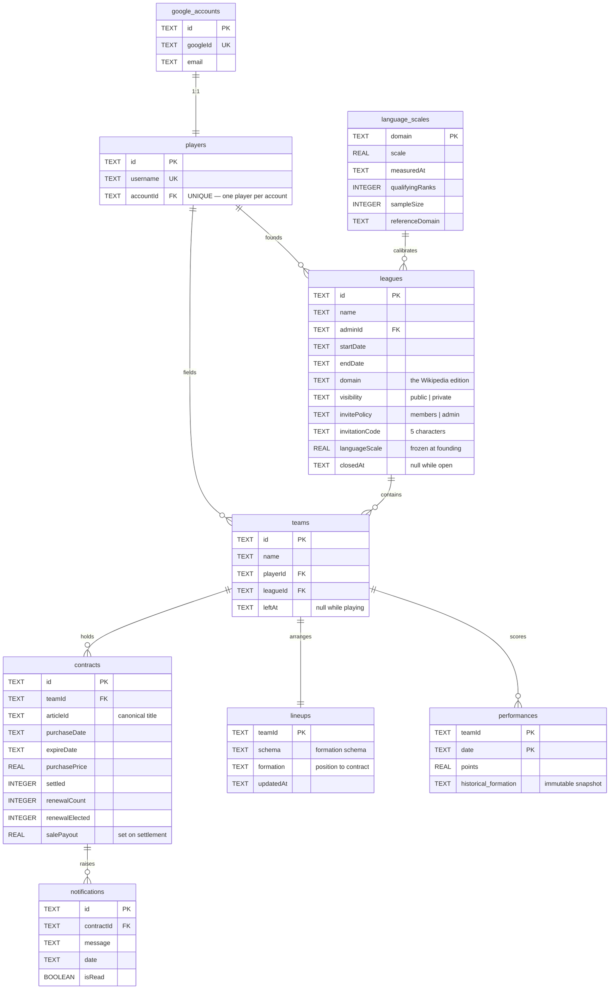

# Data model

Persistence is Cloudflare D1 — SQLite at the edge — reached only through the
repository interfaces described in the
[architecture overview](./index.md). Nine migrations under
`backend/migrations/` are replayed in order on deploy and, in the test suite,
before every single test.

## The schema



## Five things the schema says out loud

### A team's credits are not stored

There is no `credits` column. There was one; migration `0005` dropped it and
`0006` replaced it with a view:

```sql
CREATE VIEW team_credits AS
SELECT t.id AS teamId,
       1000 - COALESCE(SUM(c.purchasePrice), 0)
            + COALESCE(SUM(CASE WHEN c.settled = 1 THEN c.salePayout ELSE 0 END), 0)
FROM teams t
LEFT JOIN contracts c ON c.teamId = t.id
GROUP BY t.id;
```

A stored balance is a second copy of a fact the contracts already contain, and
two copies of a fact eventually disagree. The view is team-anchored, so a team
with no contracts still reports the full starting budget and no caller needs a
`COALESCE`.

The `1000` is `STARTING_CREDITS` from `model/team.ts`. A view takes no bind
parameters, so the constant is pinned to the TypeScript one by an integration
test rather than by a comment.

→ [ADR 0007: Derived Team Credits](../docs/adr/0007-derived-team-credits.md)

### A league carries the calibration it was founded on

`leagues.languageScale` is a copy, not a lookup. Editions are recalibrated as
Wikipedia's traffic shifts, and a league whose prices silently re-based
mid-season would be a different game from the one its players joined. The
registry in `language_scales` is what *new* leagues are founded against.

→ [Wikipedia Language Editions](../docs/domain/language-editions.md) ·
[ADR 0002](../docs/adr/0002-language-scale-factor.md)

### Yesterday is frozen

`performances.historical_formation` is an immutable JSON snapshot of the
formation as it stood on that day, and the primary key is `(teamId, date)`.
Between them they give the two properties the nightly batch needs: a re-run
overwrites rather than duplicates, and rearranging a squad today cannot change
what it scored last week.

### Nothing anyone can still read is deleted

`leagues.closedAt` and `teams.leftAt` are timestamps, not deletions. A league
that has ended is still readable by the people who played it, and a player who
left is still part of the history of the standings they affected. Rows are only
ever cascaded away with the account that owns them.

→ [League Lifecycle](../docs/domain/league-lifecycle.md)

### The migrations record their own constraints

Three separate migrations carry a comment about what `ALTER TABLE` cannot do in
SQLite — it cannot add a `NOT NULL UNIQUE` column, which is why
`leagues.invitationCode` is nullable at the schema level and made unique by an
index instead. The constraint is the database's, and the workaround is written
down where the next person will hit it.

→ [`backend/migrations/`](https://github.com/FantasyWiki/FantasyWiki/tree/master/backend/migrations)

## Article identity

An article has no surrogate key and no `pageid`. It is identified by its
**canonical page title within the league's edition**, which is why `articleId`
is a `TEXT` column with no foreign key: the authority for that value is
Wikipedia, not this database. Titles are normalised on the way in, and the
collector echoes them back untouched.

## The migration ledger

| # | What it added |
|---|---|
| 0001 | Accounts, players, leagues, teams, contracts, notifications |
| 0002 | The seeded global league |
| 0003 | `performances` and `lineups` |
| 0004 | Contract lifecycle: `settled`, `renewalCount`, `renewalElected` |
| 0005 | `salePayout`; dropped the stored `teams.credits` |
| 0006 | The `team_credits` view |
| 0007 | League visibility, invite policy, invitation codes |
| 0008 | League closure and team departure timestamps |
| 0009 | The `language_scales` registry and `leagues.languageScale` |

## Related

- [Architecture overview](./index.md) — where the repositories sit
- [Data flow](./data-flow.md) — the journeys that touch these tables
- [Test strategy](../quality/testing.md) — how the schema is reset between tests
