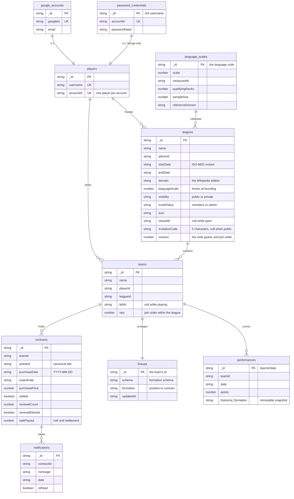
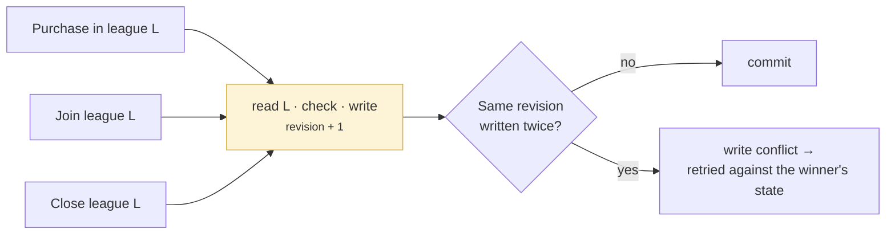

# Data model

Persistence is **MongoDB**, reached only through the repository interfaces
described in the [architecture overview](./index.md). Ten collections, no
schema migrations, and one document — the league — that every write which has to
be serialised passes through.

The backend runs on either of two targets, and MongoDB is the one described
here. The second is Cloudflare D1, which is what the Cloudflare deployment runs
on; it stores the same fields under the same names, and the differences worth
knowing are in [the second target](#the-second-target) at the foot of this page.
Nothing above `repositories/` knows which of the two it is talking to.

→ [Persistence Targets](../docs/architecture/persistence-targets.md)

## The collections

Ids are `_id`, so every lookup by id is the primary key lookup the store gives
for free and no document carries the same value twice. Lines below are
references resolved by the repositories, not a constraint the database enforces
— see [the indexes](#the-indexes-and-what-each-one-holds-up).



Dates are text — ISO-8601 instants for a league's term, `YYYY-MM-DD` for a
contract's — so a plain comparison is a chronological one and a range query
needs no conversion.

`password_credentials` is the one collection with no counterpart in the other
target, and it never will have one: only the MongoDB build carries
username/password sign-in, and the deployed Worker does not contain the code
that reads it. → [Auth Modes](../docs/architecture/auth-modes.md)

## Where the composite keys went

Two collections are keyed by something the document already contained, rather
than by a surrogate id beside it.

`performances._id` is `teamId:date`. The pair is what a night's ingest is
idempotent on, so making it the key makes the upsert a primary key upsert:
re-running a date overwrites, and cannot duplicate. `lineups._id` is the team's
id, which states in the key that a team has at most one lineup — there is no
second document to disagree with the first.

`password_credentials._id` is the username, which makes the primary key the
reservation. `players.username` says the same thing through an index, and the
two agree because `register` writes both in one transaction.

## Six things the model says out loud

### A team's credits are not stored

There is no `credits` field, and no document anywhere holds a balance. A
balance is derived from the contracts ledger on every read, as an aggregation
attached to the five reads that need one:

```js
{ $lookup: { from: "contracts", localField: "_id",
             foreignField: "teamId", as: "__ledger" } },
{ $addFields: { credits: creditsExpression("$__ledger") } },
{ $project: { __ledger: 0 } }
```

`creditsExpression` is `STARTING_CREDITS` minus the sum of every purchase, plus
the payout of every contract already settled. A stored balance is a second copy
of a fact the contracts already contain, and two copies of a fact eventually
disagree.

The rule is stated once per target — `teamCreditsStages` in
`repositories/mongo/schema.ts`, the `team_credits` view in D1 — and both are
checked against `deriveCredits` in `model/team.ts` by the conformance suite, so
the three cannot drift apart quietly.

→ [ADR 0007: Derived Team Credits](../docs/adr/0007-derived-team-credits.md)

### There is no migration runner

Mongo has no schema to migrate: a new field is written by whichever repository
writes it, and a document without it reads as absent. So what
`backend/migrations/` is to the other target, `repositories/mongo/bootstrap.ts`
is to this one, and it holds only the two things a fresh database genuinely
cannot start without — the indexes, and the baseline the product assumes exists.

The baseline is the Global League, its `system` admin account, and the
reference edition's measured scale. Every write in it is insert-if-absent, so a
database that has been running for a year comes through it untouched, which is
what lets it run on the first connection an isolate opens rather than as a
deployment step.

The price of having no migrations is paid elsewhere and is worth naming: a field
that changes meaning has no ledger recording when it changed. The migration list
in [the second target](#the-second-target) is that ledger, and it stays readable
as the history of both.

### A league carries the calibration it was founded on

`leagues.languageScale` is a copy, not a lookup. Editions are recalibrated as
Wikipedia's traffic shifts, and a league whose prices silently re-based
mid-season would be a different game from the one its players joined. The
registry in `language_scales` is what *new* leagues are founded against.

→ [Wikipedia Language Editions](../docs/domain/language-editions.md) ·
[ADR 0002](../docs/adr/0002-language-scale-factor.md)

### Yesterday is frozen

`performances.historical_formation` is an immutable JSON snapshot of the
formation as it stood on that day. With the `(teamId, date)` key above, the two
give the nightly batch the properties it needs: a re-run overwrites rather than
duplicates, and rearranging a squad today cannot change what it scored last
week.

### Nothing anyone can still read is deleted

`leagues.closedAt` and `teams.leftAt` are timestamps, not deletions. A league
that has ended is still readable by the people who played it, and a player who
left is still part of the history of the standings they affected. Documents are
only ever removed with the league that owns them, and then all together — see
[the cascade](#guarded-writes-and-what-replaces-single-statement-atomicity).

→ [League Lifecycle](../docs/domain/league-lifecycle.md)

### The document shapes are not the wire shapes

A repository returns `model/` entities, which stay normalised; the API sends
`dto/` shapes, which aggregate and nest. A document is neither — it is what this
target found convenient to store, and it is mapped on the way out. That is why
the collections above carry no embedded arrays: a team's contracts are a
collection of their own, because they are queried by expiry across every team in
the game, and embedding them would make that a scan of every team.

→ [DTO Dressing Pattern](../docs/architecture/dto-dressing-pattern.md)

## The indexes, and what each one holds up

Mongo enforces no relationship, so the constraints the model does have are
indexes, and each one is load-bearing somewhere a caller can see.

| Index | Kind | What it holds up |
|---|---|---|
| `google_accounts.googleId` | unique | One account per Google identity |
| `password_credentials.accountId` | unique | A credential belongs to exactly one account |
| `players.username` | unique | The failure a sign-up retries on |
| `players.accountId` | unique | One player per account |
| `leagues.invitationCode` | unique, **partial** | Two private leagues cannot share a code |
| `teams.(playerId, leagueId)` | unique | One team per player per league, ever — including after they leave |
| `teams.leagueId` | plain | Listing a league's members |
| `contracts.teamId` | plain | A team's portfolio, and its derived balance |
| `contracts.(settled, expireDate)` | plain | The settlement sweep's query, and only that |
| `notifications.contractId` | plain | A contract's notifications |
| `performances.(teamId, date)` | unique | Re-running a night cannot duplicate |

The partial index is the interesting one. A public league has no invitation
code, so a plain unique index would let exactly one league be public. The
`partialFilterExpression` restricts uniqueness to documents where the code is a
string, which leaves every league without one free to share the absence — the
same arrangement SQLite reaches by treating NULLs in a unique index as distinct.

## Guarded writes, and what replaces single-statement atomicity

Several repository contracts say the condition is evaluated *inside* the write:
the article is free **and** the team can afford it, the league is open **and**
has room. The other target gets that from SQLite's single-statement atomicity.
Here it is a transaction, and a transaction alone is not enough.

Mongo's transactions are **snapshot-isolated, not serializable**. Two
transactions that merely *read* the same league would both commit against a
snapshot taken before a concurrent close, and both would be wrong. So every
transaction of this kind also *writes* the document it is guarding against,
incrementing `leagues.revision`:



Writing the league puts the two transactions in each other's write set, so the
loser hits a write conflict and `withTransaction` retries it against the state
the winner left. The callback must therefore re-read anything it decides on
rather than close over an earlier read — a retried transaction that trusts a
stale value is exactly the bug the guard exists to prevent.

`revision` earns its keep twice: the value a joiner bumps it to becomes its
team's `seq`, which is the seniority order a departure hands the league on by.
The other target reads `rowid` for the same purpose.

**The grain is a league, which is coarse.** Two players buying *different*
articles in the same league contend, and one is retried. A league-scoped guard
is the honest one, because Article Availability is itself league-scoped — but
the Global League holds every player in the game, so in practice that one
document is where all the contention lands. Worth knowing before treating this
target as something to run at scale.

Single-document guards need none of this and use none of it. Settling a sale,
settling an expiry, renewing and electing a renewal are one conditional
`updateOne` each.

The one thing the other target gets for free and this one spells out is the
cascade. Deleting the last member's league takes its teams, contracts,
notifications, performances and lineups with it; D1 declares that once as
`ON DELETE CASCADE`, and `TeamRepositoryMongo.leave` deletes them explicitly,
inside the same transaction.

## One connection per request

A Worker owns its I/O objects **per request**: a socket opened while handling
one request may not be touched by the next. The driver's pooled connection is
such a socket, so a client cached in a module variable serves the request that
opened it and then breaks every request after — silently, because the driver
reports no error and the promise simply never settles.

So a client's lifetime is a request's lifetime. `MongoStore` holds one, and the
composition root builds one store per request, which gives each request a single
connection shared by all its repository calls. Nothing closes them; sockets are
reclaimed when the request context ends.

The test suite cannot catch a regression here — it runs outside any request
context, where the restriction does not apply — so a change to how the
connection is held has to be exercised with *two* requests against a running
Worker.

→ [Persistence Targets](../docs/architecture/persistence-targets.md)

## Article identity

An article has no surrogate key and no `pageid`. It is identified by its
**canonical page title within the league's edition**, which is why `articleId`
is a plain string that references nothing: the authority for that value is
Wikipedia, not this database. Titles are normalised on the way in, and the
collector echoes them back untouched.

## The second target

Cloudflare D1 — SQLite at the edge — is the second implementation of the same
repository interfaces, and it is what the Cloudflare deployment runs on. Nine
migrations under `backend/migrations/` are replayed in order on deploy.

Collection names, field names and types mirror the D1 columns deliberately. The
two targets share no code below `Repositories`, so nothing forces the
correspondence — but it means a reader who knows one schema can read the other,
and the migrations stay usable as the description of what is stored for either.

| Where they differ | MongoDB | D1 |
|---|---|---|
| Schema changes | None to make; `bootstrap.ts` holds indexes and baseline | Nine migrations, replayed on deploy |
| Derived credits | `teamCreditsStages`, an aggregation on five reads | The `team_credits` view |
| Guarded writes | A transaction that bumps `leagues.revision` | Single-statement atomicity |
| Join order | `leagues.revision` → `teams.seq` | `rowid` |
| Cascade on delete | Spelled out in the transaction | `ON DELETE CASCADE` |
| Composite keys | `_id` is `teamId:date` | A two-column primary key |
| Password sign-in | `password_credentials` | Not present in the build at all |

Three separate migrations carry a comment about what `ALTER TABLE` cannot do in
SQLite — it cannot add a `NOT NULL UNIQUE` column, which is why
`leagues.invitationCode` is nullable at the schema level and made unique by an
index instead. That constraint is the reason the Mongo index above is partial
rather than plain: the two targets arrived at the same arrangement from opposite
directions.

| # | What it added |
|---|---|
| 0001 | Accounts, players, leagues, teams, contracts, notifications |
| 0002 | The seeded global league |
| 0003 | `performances` and `lineups` |
| 0004 | Contract lifecycle: `settled`, `renewalCount`, `renewalElected` |
| 0005 | `salePayout`; dropped the stored `teams.credits` |
| 0006 | The `team_credits` view |
| 0007 | League visibility, invite policy, invitation codes |
| 0008 | League closure and team departure timestamps |
| 0009 | The `language_scales` registry and `leagues.languageScale` |

→ [`backend/migrations/`](https://github.com/FantasyWiki/FantasyWiki/tree/master/backend/migrations)

## Related

- [Persistence Targets](../docs/architecture/persistence-targets.md) — the canonical account of both targets
- [Architecture overview](./index.md) — where the repositories sit
- [Data flow](./data-flow.md) — the journeys that touch these collections
- [Test strategy](../quality/testing.md) — how the suite runs against either target
