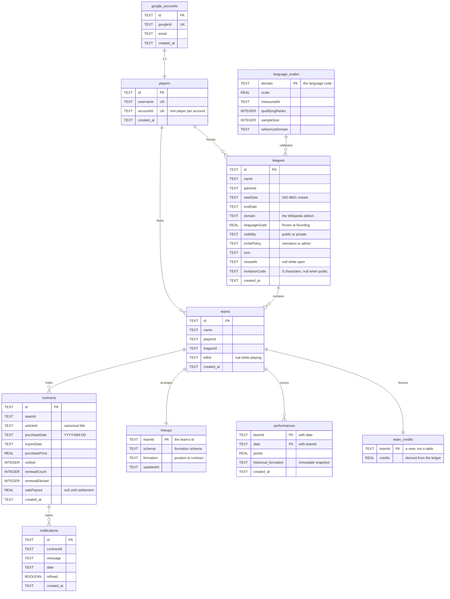
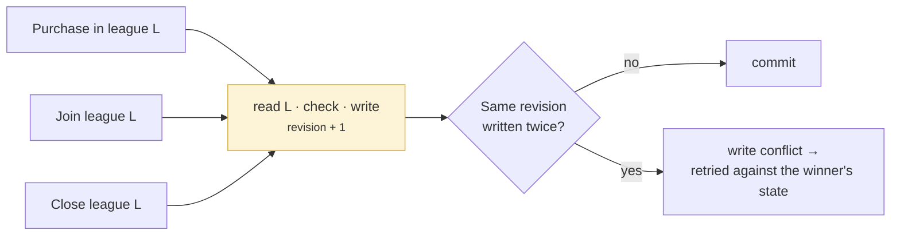

# Data model

Persistence is **Cloudflare D1**, SQLite at the edge, reached only through the
repository interfaces described in the [architecture overview](./index.md). Nine
tables, one view, and nine migrations replayed in order on every deploy.

D1 is what the deployment runs on, and it is the target described here. The
second implementation is MongoDB, which stores the same fields under the same
names but is never deployed; the differences worth knowing are in
[the second target](#the-second-target) at the foot of this page. Nothing above
`repositories/` knows which of the two it is talking to.

→ [Persistence Targets](../docs/architecture/persistence-targets.md)

## The tables

Ids are `id`, declared `TEXT PRIMARY KEY`, so every lookup by id is the primary
key lookup the store gives for free. Lines below are references resolved by the
repositories rather than foreign keys the database enforces, except where the
cascade needs one, see [the constraints](#the-constraints-and-what-each-one-holds-up).



Dates are text, ISO-8601 instants for a league's term, `YYYY-MM-DD` for a
contract's, so a plain comparison is a chronological one and a range query needs
no conversion. Booleans are declared `INTEGER` on `contracts` and `BOOLEAN` on
`notifications.isRead`; SQLite stores both as integers either way, which is the
only boolean it has.

## Where the composite keys went

Three tables are keyed by something the row already contained, rather than by a
surrogate id beside it.

`performances` has a two-column primary key, `(teamId, date)`. The pair is what a
night's ingest is idempotent on, so making it the key makes the upsert a primary
key upsert: re-running a date overwrites, and cannot duplicate. `lineups` is
keyed on `teamId`, which states in the key that a team has at most one lineup,
there is no second row to disagree with the first. `language_scales` is keyed on
`domain`, because an edition has exactly one measured scale at a time.

## Six things the model says out loud

### A team's credits are not stored

There is no `credits` column, and no row anywhere holds a balance. Migration
0005 dropped the column that used to; 0006 replaced it with a view that derives
the balance from the contracts ledger on every read:

```sql
CREATE VIEW IF NOT EXISTS team_credits AS
SELECT t.id AS teamId,
       1000 - COALESCE(SUM(c.purchasePrice), 0)
            + COALESCE(SUM(CASE WHEN c.settled = 1 THEN c.salePayout ELSE 0 END), 0) AS credits
FROM teams t
LEFT JOIN contracts c ON c.teamId = t.id
GROUP BY t.id;
```

A stored balance is a second copy of a fact the contracts already contain, and
two copies of a fact eventually disagree. Every read that needs a balance joins
the view; `TeamRepositoryD1.getByPlayerAndLeague` is the one every self-scoped
feature goes through.

The rule is stated once per target, the `team_credits` view here and
`teamCreditsStages` in `repositories/mongo/schema.ts` there, and both are checked
against `deriveCredits` in `model/team.ts` by the conformance suite, so the three
cannot drift apart quietly.

→ [ADR 0007: Derived Team Credits](../docs/adr/0007-derived-team-credits.md)

### The migrations are the ledger

`backend/migrations/` holds nine files, replayed in order, and they are the only
record of when a field started meaning what it means. A schema that changes by
migration can be read backwards; the history of the model is the directory
listing.

| # | What it added |
|---|---|
| 0001 | Accounts, players, leagues, teams, contracts, notifications |
| 0002 | The seeded global league |
| 0003 | `performances` and `lineups` |
| 0004 | Contract lifecycle: `settled`, `renewalCount`, `renewalElected` |
| 0005 | `salePayout`; dropped the stored `teams.credits` |
| 0006 | The `team_credits` view |
| 0007 | League visibility, invite policy, invitation codes |
| 0008 | League closure and team departure timestamps |
| 0009 | The `language_scales` registry and `leagues.languageScale` |

Three of them carry a comment about what `ALTER TABLE` cannot do in SQLite: it
cannot add a `NOT NULL UNIQUE` column to an existing table. That is why
`leagues.invitationCode` is nullable at the schema level and made unique by a
partial index instead.

→ [`backend/migrations/`](https://github.com/FantasyWiki/FantasyWiki/tree/master/backend/migrations)

### A league carries the calibration it was founded on

`leagues.languageScale` is a copy, not a lookup. Editions are recalibrated as
Wikipedia's traffic shifts, and a league whose prices silently re-based
mid-season would be a different game from the one its players joined. The
registry in `language_scales` is what *new* leagues are founded against.

→ [Wikipedia Language Editions](../docs/domain/language-editions.md) ·
[ADR 0002](../docs/adr/0002-language-scale-factor.md)

### Yesterday is frozen

`performances.historical_formation` is an immutable JSON snapshot of the
formation as it stood on that day. With the `(teamId, date)` key above, the two
give the nightly batch the properties it needs: a re-run overwrites rather than
duplicates, and rearranging a squad today cannot change what it scored last
week.

### Nothing anyone can still read is deleted

`leagues.closedAt` and `teams.leftAt` are timestamps, not deletions. A league
that has ended is still readable by the people who played it, and a player who
left is still part of the history of the standings they affected. Rows are only
ever removed with the league that owns them, and then all together, through
`ON DELETE CASCADE`.

→ [League Lifecycle](../docs/domain/league-lifecycle.md)

### The row shapes are not the wire shapes

A repository returns `model/` entities, which stay normalised; the API sends
`dto/` shapes, which aggregate and nest. A row is neither; it is what this target
found convenient to store, and it is mapped on the way out. That is why the
tables above carry no denormalised copies: a team's contracts are a table of
their own, because they are queried by expiry across every team in the game.

→ [DTO Dressing Pattern](../docs/architecture/dto-dressing-pattern.md)

## The constraints, and what each one holds up

Each of these is load-bearing somewhere a caller can see.

| Constraint | Kind | What it holds up |
|---|---|---|
| `players.username` | unique | The failure a sign-up retries on |
| `players.accountId` | unique | One player per account |
| `google_accounts.googleId` | unique | One account per Google identity |
| `idx_leagues_invitationCode` | unique, **partial** | Two private leagues cannot share a code |
| `performances (teamId, date)` | primary key | Re-running a night cannot duplicate |
| `lineups.teamId` | primary key | A team has at most one lineup |
| `idx_teams_leagueId` | plain | Listing a league's members |
| `idx_contracts_teamId` | plain | A team's portfolio, and its derived balance |
| `idx_contracts_settled_expire` | plain | The settlement sweep's query, and only that |
| `idx_notifications_contractId` | plain | A contract's notifications |
| `ON DELETE CASCADE` | foreign key | A deleted league takes everything it owned |

The partial index is the interesting one. A public league has no invitation
code, so a plain unique index over a nullable column would be ambiguous. SQLite
treats NULLs in a unique index as distinct, which leaves every league without a
code free to share the absence, and the index is restricted to the rows that have
one.

## Guarded writes, and where the condition lives

Several repository contracts say the condition is evaluated *inside* the write:
the article is free **and** the team can afford it, the league is open **and**
has room. On this target that is not a transaction. It is one statement, and
SQLite's single-statement atomicity is what makes it correct:

```sql
INSERT INTO teams (id, name, playerId, leagueId)
SELECT ?, ?, ?, l.id
  FROM leagues l
 WHERE l.id = ?
   AND l.closedAt IS NULL
   AND NOT EXISTS (SELECT 1 FROM teams t WHERE …)
```

The row is inserted only if the `SELECT` that feeds it returns one, and the
`SELECT` is evaluated within the same statement, so nothing can change between
the check and the write. A caller learns which guard refused by the number of
rows the statement reported changing.

The same shape carries the purchase check, and
[ADR 0007](../docs/adr/0007-derived-team-credits.md) explains why it lives in the
`INSERT` rather than in the aggregate that owns the invariant: the
read-then-write alternative is not merely less tidy, it is wrong under
concurrent buys.

Join order comes from `rowid`, which SQLite maintains for free, and is what a
departure hands the league's seniority on by.

## Article identity

An article has no surrogate key and no `pageid`. It is identified by its
**canonical page title within the league's edition**, which is why `articleId` is
a plain string that references nothing: the authority for that value is
Wikipedia, not this database. Titles are normalised on the way in, and the
collector echoes them back untouched.

## The second target

**MongoDB** is a second implementation of the same repository interfaces. It is
not deployed anywhere: `wrangler.jsonc` aliases the driver away, so the Worker
Cloudflare runs neither carries it nor could reach it. It runs locally, against a
single-node replica set, from `wrangler.mongo.jsonc`.

It is not a fallback. It is the evidence that the repository boundary is real,
and the reason the choice of store stayed a decision rather than becoming a
dependency: the same conformance suite runs against both on every
`./gradlew check`, so a store that can be swapped in a test run is a store that
can be swapped when the bill changes.

Collection names, field names and types mirror the D1 columns deliberately. The
two targets share no code below `Repositories`, so nothing forces the
correspondence, but it means a reader who knows one schema can read the other.

| Where they differ | D1 | MongoDB |
|---|---|---|
| Schema changes | Nine migrations, replayed on deploy | None to make; `bootstrap.ts` holds indexes and baseline |
| Derived credits | The `team_credits` view | `teamCreditsStages`, an aggregation on five reads |
| Guarded writes | Single-statement atomicity | A transaction that bumps `leagues.revision` |
| Join order | `rowid` | `leagues.revision` → `teams.seq` |
| Cascade on delete | `ON DELETE CASCADE` | Spelled out in the transaction |
| Composite keys | A two-column primary key | `_id` is `teamId:date` |
| Ids | `id` | `_id` |
| Password sign-in | Not present in the build at all | `password_credentials` |
| Connections | A binding; nothing to open or close | One client per request, and no reuse across them |

Two of those rows are worth a paragraph each, because they are where the second
target had to work for what the first gets from the storage engine.

**Its transactions are snapshot-isolated, not serializable.** Two transactions
that merely *read* the same league would both commit against a snapshot taken
before a concurrent close, and both would be wrong. So every guarded write also
*writes* the league it is guarding against, incrementing `leagues.revision`,
which puts the two transactions in each other's write set and makes the loser
retry against the winner's state:



The grain is a league, which is coarse: two players buying *different* articles
in the same league contend, and one is retried. A league-scoped guard is the
right one, because Article Availability is itself league-scoped, but the Global
League holds every player in the game, so that one document is where the
contention lands.

**A Worker owns its I/O objects per request.** A socket opened while handling one
request may not be touched by the next, and the driver's pooled connection is
such a socket, so a client cached in a module variable serves the request that
opened it and then breaks every request after — silently, because the driver
reports no error and the promise simply never settles. `MongoStore` therefore
holds one client per request, built by the composition root. D1 has none of this
to arrange: a binding is not a socket.

→ [Auth Modes](../docs/architecture/auth-modes.md) ·
[Persistence Targets](../docs/architecture/persistence-targets.md)

## Related

- [Persistence Targets](../docs/architecture/persistence-targets.md): the canonical account of both targets
- [Architecture overview](./index.md): where the repositories sit
- [Data flow](./data-flow.md): the journeys that touch these tables
- [Test strategy](../quality/testing.md): how the suite runs against either target
