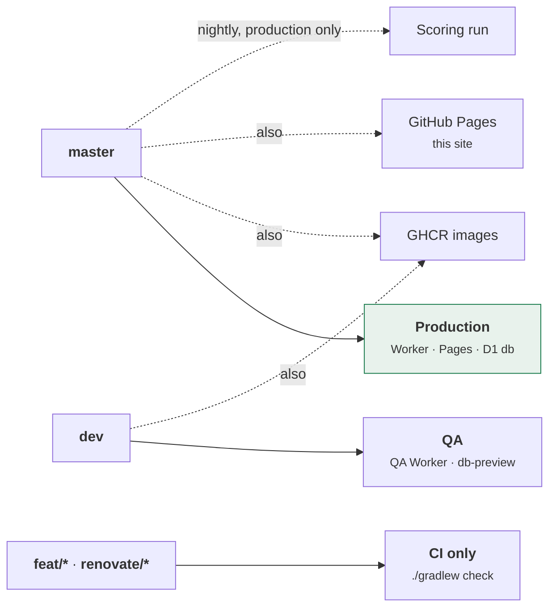
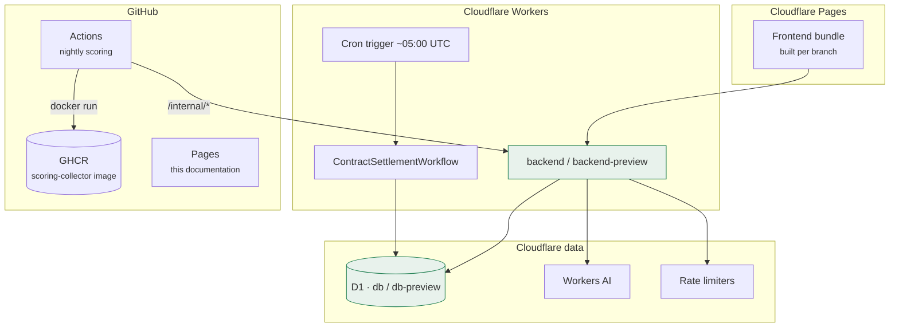
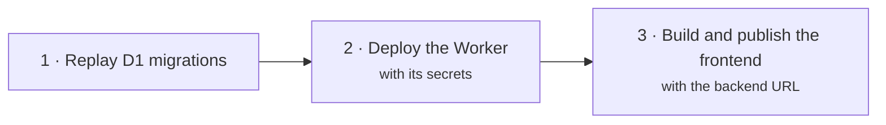

# Deployment

Everything is branch-driven. There is no deploy button and no manual promotion:
what is on `master` is production, what is on `dev` is QA, and a feature branch
is checked and nothing else.

## Branch to environment

The two environments are genuinely separate down to the database: QA has its own
D1 instance, its own Google OAuth client and its own JWT secret. A bad migration
on `dev` cannot reach a real player's league.

→ [Deploy Strategy](../docs/deployment/deploy-strategy.md) ·
[Dev Branch Deployment](../docs/deployment/dev-branch-deployment.md)

## What runs where

## The order a deploy happens in

Migrations first, then the Worker, then the frontend. The order is not
negotiable: a Worker deployed against a schema it expects but D1 has not
received yet is a production error for as long as the gap lasts.

The Worker bundles `model/` and `dto/` from the repository root, so the deploy
installs the root dependencies before running Wrangler — esbuild resolves those
imports from the root `node_modules`, not the backend's.

## The nightly scoring run

Scoring is the one scheduled job that lives outside Cloudflare, and it runs the
**published container image** rather than the sources.

- It targets **production only**. QA is not scored.
- It runs the image `publish-images.yml` pushed to GHCR for `master`, so the
  night scores exactly the artefact that was published — no checkout, no JDK.
- Concurrency is keyed on the date, so two runs never score the same day at
  once. Ingest is idempotent anyway, but overlapping runs waste Wikimedia budget.
- A repository variable, `SCORING_RUNNER=external`, hands the nightly over to
  something else without a code change. A manual dispatch always runs regardless
  — clicking *Run* is an explicit instruction, and it is how a missed day gets
  backfilled mid-handover.
- An unrecognised value for that variable runs the job anyway, deliberately:
  scoring twice costs Wikimedia budget, scoring never costs a missing day, so a
  typo fails toward the cheap mistake.

→ [Nightly Scoring Pipeline](../docs/architecture/scoring-pipeline.md)

## Secrets, and who holds them

| Secret | Held by | What it opens |
|---|---|---|
| `CLOUDFLARE_API_TOKEN` · `CLOUDFLARE_ACCOUNT_ID` | The deploy job | Wrangler and Pages |
| `GOOGLE_CLIENT_ID` · `GOOGLE_CLIENT_SECRET` | The Worker, per environment | Sign-in |
| `JWT_SECRET` | The Worker, per environment | Session signing |
| `SCORING_INGEST_SECRET` | The Worker **and** the nightly job | `/internal/*` |
| `GH_APP_PRIVATE_KEY` | The Worker | Filing problem reports as the bot |
| `CLOUDFLARE_D1_MIGRATION_RUNNER_SECRET` | The migration job | Replaying migrations |
| `GITHUB_TOKEN` | Actions, automatically | GHCR, and publishing this site |

The GitHub App key is optional on purpose: a deploy still succeeds before it is
set, and the report form answers `502` until it is. A feature that is not
configured yet should degrade, not block a release.

The collector holds exactly two credentials — the ingest secret and a Wikimedia
user agent — and no database access at all. It is the least privileged thing in
the system despite being the one that runs unattended.

## Running the whole stack locally

`./gradlew noGenie` brings up the frontend, the Worker and a local D1 with **no
credentials to obtain**: the compose file wires the dev sign-in route, which
mints a normal session and refuses to exist outside the local environment. Three
sibling tasks — `up`, `demo`, `demoNoGenie` — add the Article Genie, the seeded
demo league, or neither.

→ [Running FantasyWiki in Docker](../docs/development/docker-local-dev.md) ·
[Local Development Setup](../docs/development/local-dev-setup.md)

## Related

- [Continuous delivery](../quality/ci-cd.md) — the workflows that drive all of this
- [Architecture overview](./index.md)
- [Setup QA Deploy](../docs/deployment/setup-qa-deploy.md) — the one-time setup
