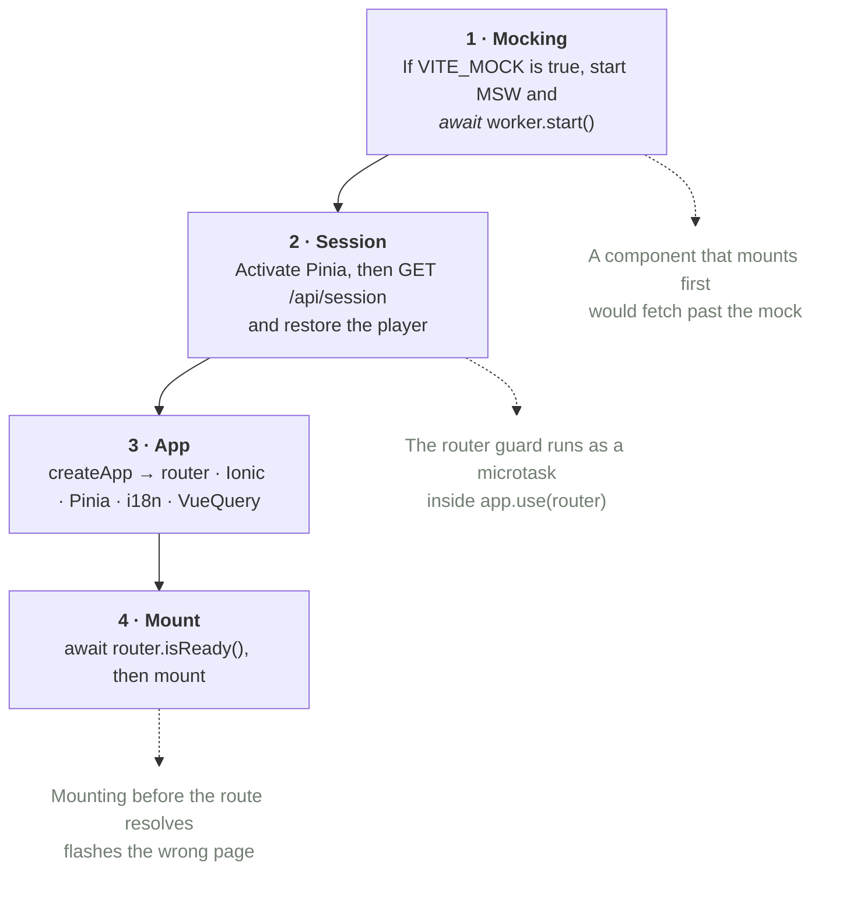
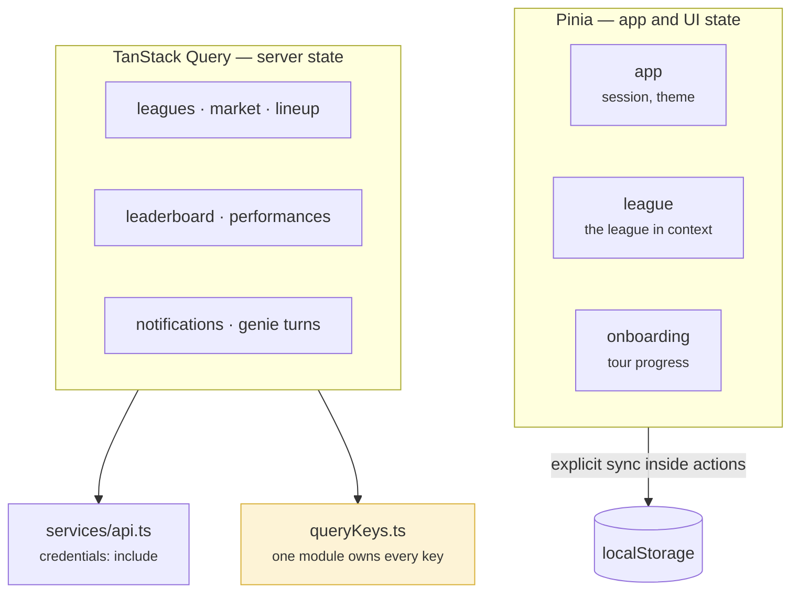

# Frontend

A Vue 3 single-page app built on Ionic, deployed to Cloudflare Pages. It is a
game board rather than a dashboard, and the visual system that says so is
[`DESIGN.md`](../DESIGN.md) — the same palette this documentation site wears.

## Bootstrapping, in order

`main.ts` is one of the few files in the repository where the order of the lines
is itself the design. Four steps, each of which must finish before the next
begins.

Step 2 is the subtle one. The router's `beforeEach` guard fires during
`app.use(router)`, so the authentication state has to be settled *before* the
router is installed — otherwise the first navigation is decided by a session
the app has not fetched yet, and a signed-in player is bounced to the landing
page on every reload.

## Who owns which state

Three stores, kept strictly apart. The rule is that server state is never copied
into a Pinia store.

**Why the separation is worth the discipline.** A league's leaderboard held in a
store has to be invalidated by hand every time anything changes it, from every
place that could change it. Held in Query, it is invalidated by naming its key —
and because a single module owns the keys, "naming its key" is a compile-time
operation rather than an act of memory.

Persistent UI state — theme, dismissed tours — is synced to `localStorage`
explicitly inside store actions rather than by a plugin, so the write is visible
at the place the decision is made.

→ [Frontend Query Keys](../docs/architecture/frontend-query-keys.md)

## Routes

Everything is authenticated unless its route says `meta: { public: true }` —
the default is closed, which is the direction that fails safe.

| Public | Authenticated |
|---|---|
| `/home` · `/guide` · `/legal` · `/auth/callback` · the 404 | `/dashboard` · `/leagues` · `/leagues/new` · `/leagues/join` · `/leagues/:id` · `/market` · `/team` · `/team-creation` · `/report` |

Two routes carry a `beforeEnter` of their own: both team-creation entries
refuse to open for a player who already has a team in that league. Guards are
tested in their own spec files rather than through a mounted page — a mounting
spec gives the guard a different Pinia instance and quietly tests nothing.

## Server state deserialisation

Backend responses carry `Temporal` values, and `JSON.parse` returns them as
strings. They are revived explicitly in the service layer —
`Temporal.Instant.from`, `Temporal.Duration.from` — never in a component. A
component that receives a string where it expected an `Instant` fails somewhere
far from the cause.

## Running it without a backend

`VITE_MOCK=true` puts MSW in front of every `/api/*` call, with two deliberate
holes: `/api/session` and `/auth/*` pass through to the real local Worker, so
sign-in is exercised for real while the game data is fabricated.

The same handlers run in the test suite, with `onUnhandledRequest: "error"` —
a request no handler expects fails the test rather than escaping to the network.

One trap is handled in code because it cost somebody an afternoon: MSW registers
a genuine Service Worker, which keeps intercepting on later page loads until it
is unregistered. A non-mock dev run therefore unregisters any worker a previous
mock run left behind.

→ [Local Development Setup](../docs/development/local-dev-setup.md)

## Theming and language

Colours come from Ionic CSS variables in `frontend/src/theme/variables.css` —
League Green, Wiki Gold, paper-sage neutrals — with a dark palette alongside.
Nothing hard-codes a hex value.

Fonts are self-hosted rather than fetched from a CDN: Source Sans 3 as a single
variable file covering the whole weight range, Libre Baskerville in the two
weights headings actually render, every subset gated by `unicode-range` so an
English or Italian visitor downloads Latin only.

The interface is translated (`en`, `it`) through `vue-i18n`, with the locale
files typed by a schema so a missing key is a build error rather than a blank
label in production.

## Related

- [Interface design](./interface.md) — the screens these pieces render, and the rules they follow
- [Architecture overview](./index.md)
- [Data flow](./data-flow.md) — what the browser sends and caches
- [Chemistry Links Rendering](../docs/architecture/chemistry-links-rendering.md)
- [Lineup Editing](../docs/architecture/lineup-editing.md)
- [Design system](../DESIGN.md)
