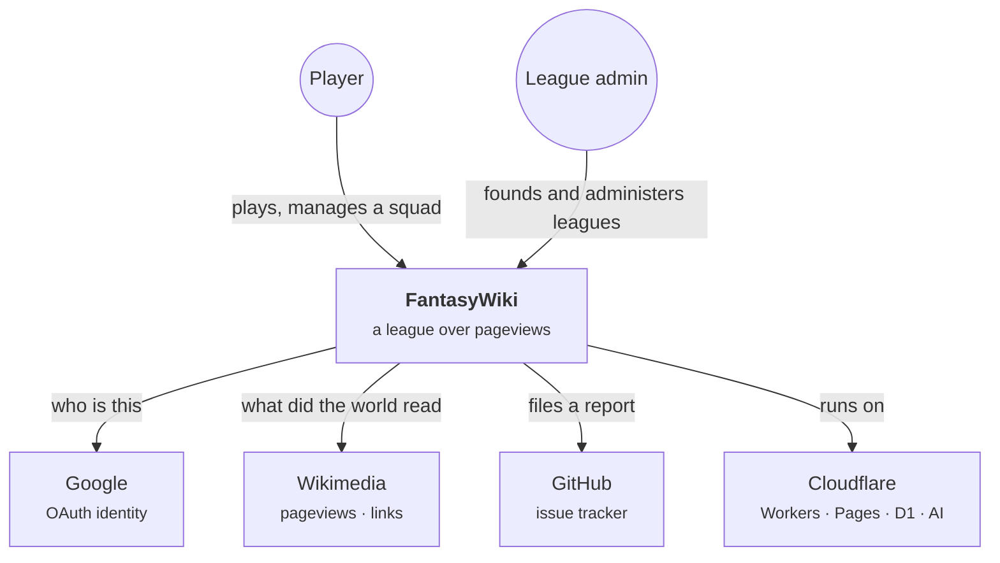
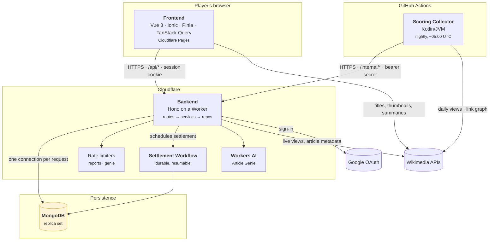
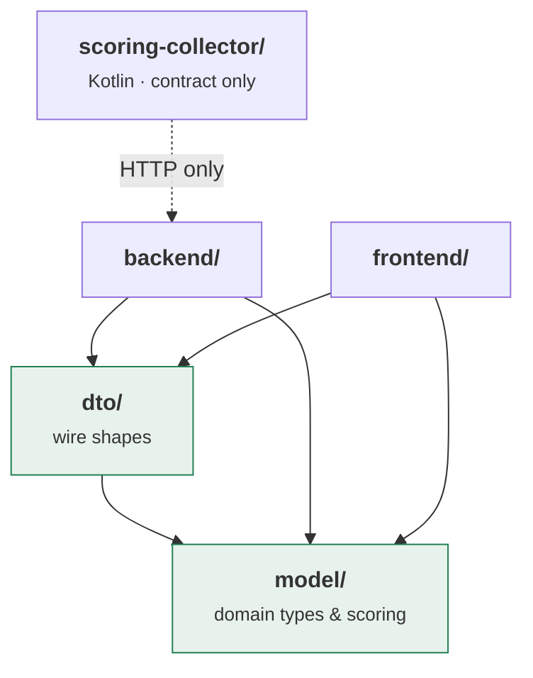
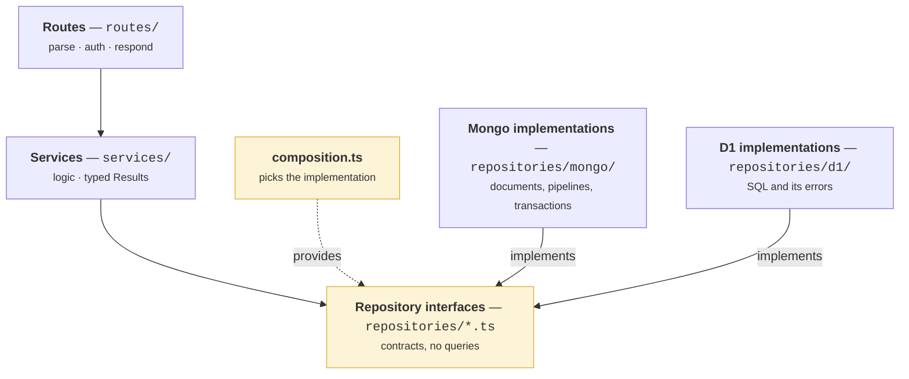

# Architecture overview

FantasyWiki is a monorepo with five deployable or publishable pieces and two
shared type packages, orchestrated by Gradle over npm. This page is the map. The
rules each piece implements live under [`domain/`](../docs/); the detail of how
each is built lives under [`architecture/`](../docs/architecture/backend-architecture.md).

## Context

Who talks to the system, and what it talks to.

## Containers

Five runtimes. Note what does **not** connect: the collector has no database
credential, and the frontend never talks to the database at all.

The store sits outside the Cloudflare box because it is the one container that
is not a Cloudflare service. It is also the one container that can be swapped:
the backend holds repository *interfaces*, and the Cloudflare deployment
configures the second implementation — D1 — in MongoDB's place. Which one a
build gets is decided in a single module, below.

| Container | Runtime | Deployed by | Documented in |
|---|---|---|---|
| Frontend | Vue 3 + Ionic SPA | Cloudflare Pages, per branch | [Frontend](./frontend.md) |
| Backend | Hono on a Cloudflare Worker | Wrangler, per branch | [Backend Architecture](../docs/architecture/backend-architecture.md) |
| MongoDB | A replica set, reached over the driver | Indexes and baseline on first connection | [Data model](./data-model.md) |
| D1 | SQLite at the edge — the second target | Migrations replayed on deploy | [Persistence Targets](../docs/architecture/persistence-targets.md) |
| Settlement Workflow | Cloudflare Workflows | Bundled with the Worker | [ADR 0003](../docs/adr/0003-closed-trading-economy.md) |
| Scoring Collector | Kotlin/JVM, `application` plugin | GitHub Actions cron + GHCR image | [Scoring Pipeline](../docs/architecture/scoring-pipeline.md) |

## Packages

Two of the seven directories exist purely so the other five cannot disagree with
each other.

**`model/` holds normalised, framework-free entities** — what a Contract *is*,
independent of how it is stored or sent. It imports nothing from a framework, so
both a Worker and a browser can use it.
→ [What Are Model Entities](../docs/domain/what-are-model-entities.md)

**`dto/` holds the wire shapes** — what the API sends, which is deliberately not
the same as what the domain contains. DTOs aggregate and nest; entities stay
normalised. Each side "dresses" the domain for its own purpose.
→ [Shared DTO Package](../docs/domain/shared-dto-package.md) ·
[DTO Dressing Pattern](../docs/architecture/dto-dressing-pattern.md)

**The collector shares neither.** It is a JVM process, and giving it generated
types would couple a compiled module to a TypeScript build. It gets an HTTP
contract and a bearer secret, and that is all it is allowed to know.

## The backend's layers

Three layers, each talking only to the one below it.

The interesting line is the dotted one. `composition.ts` is the single place
that decides which store the system is running on — it reads a binding and
returns one set of implementations — and the rule is enforced mechanically:
`no-restricted-imports` forbids anything under `services/`, `routes/` or
`tests/` from naming `repositories/d1/**` **or** `repositories/mongo/**`.

That the second implementation exists is what makes this more than an
intention. MongoDB was added without a change above the repository layer, and
the conformance suite the first target passed became the second's acceptance
criteria unchanged.
→ [Persistence Targets](../docs/architecture/persistence-targets.md)

Services may call other services, and are encouraged to: a rule implemented
twice is a rule that will eventually be two different rules.

→ [Backend Architecture](../docs/architecture/backend-architecture.md) ·
[Backend Error Constants](../docs/architecture/backend-error-constants.md)

## The seams worth knowing about

Each of these is a place where the code was deliberately cut so that one side
can change without the other noticing.

| Seam | What it separates | Why |
|---|---|---|
| `composition.ts` | Business logic from the database | So the store can be replaced without touching a service — and a second one was ([the layers, above](#the-backend-s-layers)) |
| `/internal/*` | The scoring engine from the game | The collector computes nothing and knows no rules ([pipeline](../docs/architecture/scoring-pipeline.md)) |
| `DraftLineup` | Editing a formation from saving one | Pure mutations, testable without a server ([lineup editing](../docs/architecture/lineup-editing.md)) |
| `buildArticleDetail` | Article facts from viewer context | Ownership is resolved once, asynchronously ([ownership resolution](../docs/architecture/article-ownership-resolution.md)) |
| Wikimedia client capabilities | Transport from behaviour | A capability is added without touching the composition root ([client architecture](../docs/architecture/wikimedia-client-architecture.md)) |
| Query keys module | Cache identity from call sites | One module owns every TanStack key ([query keys](../docs/architecture/frontend-query-keys.md)) |

## Where to go next

- [Data flow](./data-flow.md) — sign-in, a request through the layers, a night of scoring
- [Data model](./data-model.md) — the collections, the derived balance, and the invariants
- [Frontend](./frontend.md) — state ownership, bootstrapping order, mocking
- [Deployment](./deployment.md) — branches, environments, and what ships where

## Related

- [What FantasyWiki is](../overview/what-is-fantasywiki.md)
- [Requirements](../overview/requirements.md)
- [The Docs Atlas](../index.md#the-docs-atlas)
