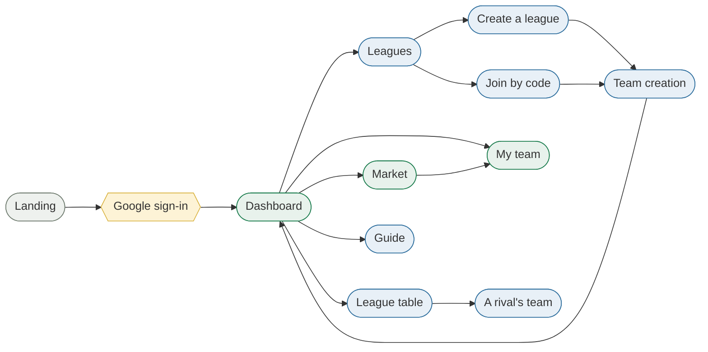

# Interface design

The interface has one job that the architecture does not: it has to make a
strategy legible. A player's decision — which article to buy, where to place it,
whether to sell early — is only a decision if the information behind it is
visible at the moment it is taken. Everything below follows from that.

## The screens, and the path between them

Fifteen views, but only four paths a player is ever on: getting in, getting into
a league, playing the week, and looking outward at the competition.

Only the landing page, the guide, the legal page and the auth callback are
public. Everything else resolves a player from the session cookie before it
renders, and team creation additionally refuses to open for a player who already
has a team in that league — a guard on the route rather than a check inside the
page, so the rule cannot be reached by a link.
→ [Frontend](./frontend.md)

## What the visual system is held to

The tokens themselves — the greens, the gold, the two typefaces, the spacing
scale — are stated once in
[`DESIGN.md`](../DESIGN.md) and consumed as Ionic CSS variables. They are not
repeated here. What is worth saying is the reasoning they encode:

- **League Green is an action, Wiki Gold is a reward.** The green marks what a
  player can do; the gold marks rank, prestige and outcome. A gold surface that
  is not saying "you placed" is the accent spent for nothing.
- **A serif for knowledge, a sans for control.** Libre Baskerville carries the
  display and title moments, because the subject is an encyclopedia; Source
  Sans 3 carries body and labels, because numbers and controls have to be
  scanned rather than read.
- **Mostly flat, with lift used sparingly.** Elevation is a signal about state,
  not a decoration, so a raised surface means something is modal or active.
- **Error, loading and empty states are designed, not defaulted.** Each one is
  explicit and offers the next action, because an empty league table with no
  explanation is indistinguishable from a broken one.

## The tone the screens are written in

The product's register is a game, not a dashboard — which is a constraint on
copy as much as on colour.
→ [`PRODUCT.md`](../PRODUCT.md)

Two rules the codebase actually holds itself to:

- **Chrome stays understated.** Footers and secondary furniture are compact and
  muted; there are no section headings on structural elements that carry no
  content.
- **Player-facing features stay in character.** Internal counts are turned into
  language a player would use rather than shown as numbers — a bucket, not a
  gauge. The Article Genie being *asleep* when its daily model quota is spent is
  the clearest case: the player is told the Genie is asleep, not that a rate
  limit returned 429.

## Accessibility

**The target is WCAG 2.2 AA.** It was set on 2026-08-30, when the interface was
first measured against it — before that the page recorded no target, because
naming one that nothing had been checked against would have claimed more than
was known.

### How it was measured

`axe-core` against the running application, on twelve screens — the landing
page, guide, legal, dashboard, league list, a league, league creation, joining,
the market, the team page, the problem report and the not-found page — in
**both themes**, under the `wcag2a`, `wcag2aa`, `wcag21a`, `wcag21aa` and
`wcag22aa` rulesets. Signed in, with data on screen: an empty state fails
nothing.

The first run returned **eight rule types across 370 failing nodes in light and
163 in dark**. After the changes below it returns **none**, in either theme.

### What it found, and what changed

| What failed | Where it came from | What was done |
|---|---|---|
| Card text at **1.03:1** in dark mode — invisible | `--ion-card-color: var(--ion-text-color)` declared on `:root`, where the dark override does not reach, so cards kept the light text colour on a dark card | The declaration repeated inside the dark palette, with the substitution rule that caused it written down |
| Muted body text at 4.03:1, everywhere | The muted colour was one notch under AA on paper, and further under it on the tinted panels | Darkened to `#647064`, chosen against every surface the app paints |
| 120 icons announced as unlabelled images | `ion-icon` renders `role="img"`; none carried `aria-hidden` | Every decorative icon marked `aria-hidden`; the icon-only buttons carry the name instead |
| Pinch-zoom disabled on every page | `user-scalable=no, maximum-scale=1` in the viewport meta — Ionic's starter default | Both removed (1.4.4) |
| The logo unreachable by keyboard | A `
` with a click handler | A `<button>` with an accessible name, styled back to a logo |
| Buttons with no name; a progress bar with no name | Icon-only controls on the market and team pages | Labelled, through the message catalogue |
| A row that was not in a table, a grid whose children were not cells | Half-applied ARIA on the standings and the pitch | The claims removed rather than propped up — see below |
| Ionic's own muted defaults at 2.45:1 and 2.82:1 | Label paragraphs and card subtitles fall back to a step on Ionic's neutral ramp | Routed through the audited muted colour |
| Placeholders at 2.4:1 | Ionic fades placeholder text to 60% of the current colour | The fade removed and the colour named |

### What automation cannot see, and what was done about it

An automated pass covers roughly a third of WCAG, and none of the part that
matters most here: whether the game can be *played* without a pointer.

The formation editor is drag-and-drop. A placed contract and a bench contract
were already `<button>`s, so both could be focused and selected — but an **empty
position was a `
`**, droppable by mouse and unreachable by tab. A player
using a keyboard could pick a contract up and have nowhere to put it, which is
2.1.1 Keyboard, a level-A failure that no contrast tool would ever report. Empty
positions are now buttons, and the path — select a contract, move to a position,
activate — is covered by a test so it cannot quietly regress.

### What is still open

Recorded rather than claimed, because none of it has been measured:

- **No screen-reader pass.** Nothing here has been driven with NVDA, JAWS or
  VoiceOver, and reading order and announcement quality are exactly what a rule
  engine cannot judge.
- **The standings are not a table.** They carried `role="row"` with no table
  around it, which promises a structure the markup does not keep; the claim was
  removed, and the board reads as a list of buttons. Real table semantics —
  `table` / `row` / `cell` around interactive rows — is the improvement that was
  not made.
- **Reflow and text spacing** (1.4.10, 1.4.12) are untested: the app is
  responsive by construction, but nobody has held it at 400% zoom.
- **Target sizes** (2.5.8) have not been measured.
- **The audit is a point in time, not a gate.** It runs against a running app
  with a browser driving it, which the unit suite cannot do — so nothing in CI
  currently fails when a new page reintroduces one of the rows above.

## Related

- [Frontend](./frontend.md) — how these screens are built and what holds their state
- [What FantasyWiki is](../overview/what-is-fantasywiki.md) — the loop the screens serve
- [`DESIGN.md`](../DESIGN.md) — the tokens, stated once
- [`PRODUCT.md`](../PRODUCT.md) — the audience, the register and the design principles
