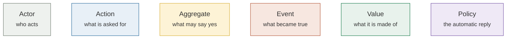
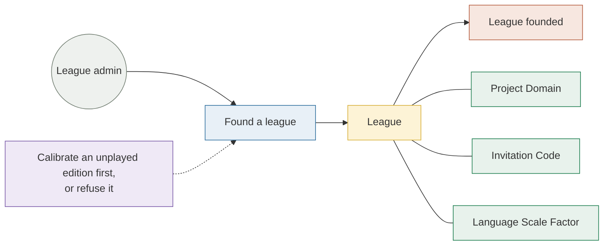
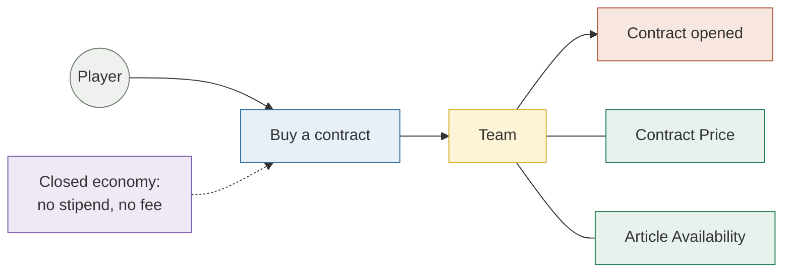
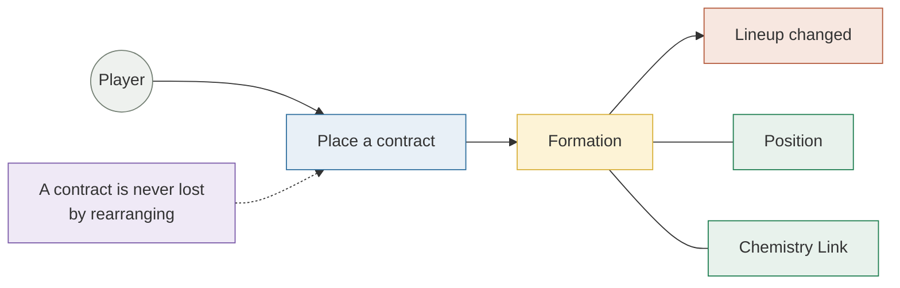
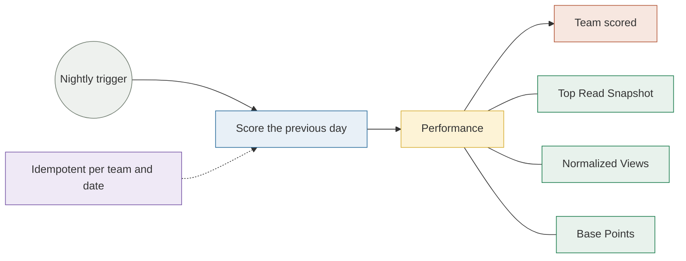

# Requirements

Requirements here are traceable rather than declared. Every functional
obligation points at the document that specifies it and, where it is already
built, at the module that satisfies it. A requirement with no document is a
requirement nobody has agreed on yet, and this page says so rather than
implying otherwise.

The original brief is the Game Design Document,
[FantaWiki Requirements v5.5](../docs/domain/fantawiki-requirements.md). It is
kept as written and is **partly superseded**: its scoring, economy and
tournament sections were reconciled against the locked design, and where it
disagrees with an ADR, the ADR wins.

## The model, as a wall of notes

Requirements are easier to argue with as a domain model than as a list. Four
stories, told the way they would be told on a wall: **who** asks for something,
**what** they ask for, **which thing** is allowed to say yes, **what became
true** as a result, and the **values** the decision is made of.

### Founding a league

> As a league admin, I want to found a league on the Wikipedia edition my
> friends read, so that we compete over articles we recognise.

A league freezes its **Language Scale Factor** at founding rather than reading
it live, because a later recalibration would silently re-rate every contract
already priced. → [ADR 0002](../docs/adr/0002-language-scale-factor.md)

### Buying a contract

> As a player, I want to buy the articles I think the world is about to read,
> so that my squad scores before anyone else notices.

An article is a **Free Agent** or somebody's, never both, and the price comes
from a smoothed thirty-day average rather than yesterday's spike.
→ [ADR 0005](../docs/adr/0005-contract-pricing.md)

### Fielding a formation

> As a player, I want to place my contracts where they reinforce each other, so
> that arranging the squad is a decision and not decoration.

Two adjacent articles score extra when Wikipedia itself links them, so where a
contract sits is worth as much as which contract it is.
→ [Chemistry Links](../docs/domain/chemistry-links.md)

### Scoring the night

> As a player, I want yesterday settled before I wake up, so that the standings
> are a fact rather than a calculation I have to trigger.

The actor here is the clock, and that is the whole reason the collector exists:
a day's pageviews are only knowable once the day is over.
→ [What FantasyWiki is](./what-is-fantasywiki.md#the-system-at-a-glance)

## Functional requirements

The same obligations as a table, each pointing at what specifies it and, where
it is already built, at what satisfies it.

| # | The system must… | Specified in | Built in |
|---|---|---|---|
| F1 | Authenticate a person through Google and hold the session in an HTTP-only cookie | [Data flow](../architecture/data-flow.md) | `backend/src/routes/auth.ts` |
| F2 | Let a player found a league on any Wikipedia edition that passes the calibration floor | [Wikipedia Language Editions](../docs/domain/language-editions.md) | `services/wikipediaEditions.ts` |
| F3 | Keep a league private unless its founder says otherwise, and admit by code | [League Visibility](../docs/domain/league-visibility.md) · [ADR 0008](../docs/adr/0008-league-invitation-codes.md) | `services/invitationCode.ts` |
| F4 | Bound a season between two weeks and six months | [League Season](../docs/domain/league-season.md) | `services/league.ts` |
| F5 | Price a contract from a smoothed 30-day average rather than a spike | [ADR 0005](../docs/adr/0005-contract-pricing.md) | `model/pricing.ts` |
| F6 | Keep the money supply closed — no stipend, no fee, gains and losses settled at expiry | [ADR 0003](../docs/adr/0003-closed-trading-economy.md) · [ADR 0007](../docs/adr/0007-derived-team-credits.md) | `workflows/contractSettlement.ts` |
| F7 | Score each team on the previous day's pageviews, once, for every league | [Scoring & Economy System](../docs/domain/scoring-system.md) | `scoring-collector/` + `services/scoring.ts` |
| F8 | Award chemistry for adjacent articles that link to each other on Wikipedia | [Chemistry Links](../docs/domain/chemistry-links.md) | `services/performance.ts` |
| F9 | Show a player which articles are free, theirs, or another team's | [Article Availability](../docs/domain/article-availability.md) | `services/articleMarket.ts` |
| F10 | Never lose a contract when a formation changes | [Lineup Rules](../docs/domain/lineup-rules.md) | `services/lineup.ts` |
| F11 | Keep a league readable after it ends, and never delete what someone can still read | [League Lifecycle](../docs/domain/league-lifecycle.md) | `services/league.ts` |
| F12 | Let a player report a problem without leaving the app | [Problem Reports](../docs/architecture/problem-reports.md) | `services/problemReport.ts` |
| F13 | Answer questions about an article without naming it, as a guessing game | [ADR 0006](../docs/adr/0006-article-genie.md) · [Article Genie](../docs/architecture/article-genie-llm.md) | `services/articleGenie.ts` |

## Quality attributes

These are the properties the architecture was actually shaped by. Each one names
the mechanism that enforces it, because a quality attribute with no mechanism is
an aspiration.

### Portability of persistence

**The obligation.** The system must be able to move off Cloudflare D1 without
rewriting its business logic.

**The mechanism.** Every persistence contract is an interface under
`repositories/`, D1 is one implementation under `repositories/d1/`, and
`composition.ts` is the only module allowed to choose one. The rule is enforced
by ESLint — nothing under `services/`, `routes/` or `tests/` may import
`repositories/d1/**` — so the seam cannot erode by accident.

**The evidence.** The conformance suite in `tests/repositories/conformance` runs
against whatever implementation the composition root returns, which means the
existing tests are the second implementation's acceptance criteria.

→ [Backend Architecture](../docs/architecture/backend-architecture.md)

### Determinism of scoring

**The obligation.** Re-running a night must produce the same standings.

**The mechanism.** Ingest is an idempotent upsert keyed on `(teamId, date)`, and
the formation used for a day is frozen into the performance row as an immutable
snapshot rather than read back from the current lineup. A player who rearranges
their team today cannot change what they scored yesterday.

→ [Nightly Scoring Pipeline](../docs/architecture/scoring-pipeline.md)

### One formula, one language

**The obligation.** A scoring rule must not be implemented twice.

**The mechanism.** The collector is a JVM process and the backend is a
TypeScript Worker, so the temptation to compute points on both sides is real and
permanent. It is closed off by contract: the collector posts raw facts only, and
`model/scoring.ts` is the sole implementation of the curve.

### Cost

**The obligation.** The whole system runs on free tiers.

**The mechanism.** A Worker rather than a server, D1 rather than a managed
database, GitHub Actions rather than a scheduler, and a nightly fan-out
throttled to stay inside Wikimedia's etiquette limits. The costs that would grow
with league count are analysed in the pipeline document rather than assumed
away.

### Testability

**The obligation.** A rule must be testable without a browser and without a
network.

**The mechanism.** Tiers with an explicit rule about which layer each may name,
a seeding helper instead of raw SQL, and a database dropped and re-migrated
before every backend test.

→ [Test strategy](../quality/testing.md)

### Approachability for a new contributor

**The obligation.** Someone should be able to run the whole thing without
obtaining a single credential.

**The mechanism.** `docker compose up` against published images, a dev sign-in
route that refuses to exist outside the local environment, and MSW standing in
for the API in the browser.

→ [Running FantasyWiki in Docker](../docs/development/docker-local-dev.md)

## Constraints

| Constraint | Consequence |
|---|---|
| Wikimedia's API etiquette | The nightly fan-out is throttled and identifies itself with a user agent; the collector holds no persistent state |
| Pageviews are published in arrears | Scoring can only ever be a batch over a completed UTC day |
| Cloudflare Workers CPU budget | Ingest is chunked, and heavy work is pushed into a Workflow rather than a request |
| SQLite via D1 | `ALTER TABLE` cannot add a `NOT NULL UNIQUE` column, which is visible in more than one migration |
| AGPL-3.0 | The deployed service must carry its source link |

## What is deliberately not built

Naming these is part of the specification. Each was considered and put down on
purpose, not forgotten.

- **Weekly and monthly tournaments** — deferred until after playtesting; the
  daily league is the loop that has to work first.
- **Dynamic pricing that reacts to demand** — the price curve is already the most
  load-bearing number in the game, and a second feedback loop on top of it is
  untestable without players.
- **A global season** — private leagues among friends are the product, and a
  global ladder pulls design effort away from that.

## Related

- [What FantasyWiki is](./what-is-fantasywiki.md) — the game and its four systems
- [Architecture overview](../architecture/) — how the obligations above are arranged in code
- [FantaWiki Requirements v5.5](../docs/domain/fantawiki-requirements.md) — the original brief
