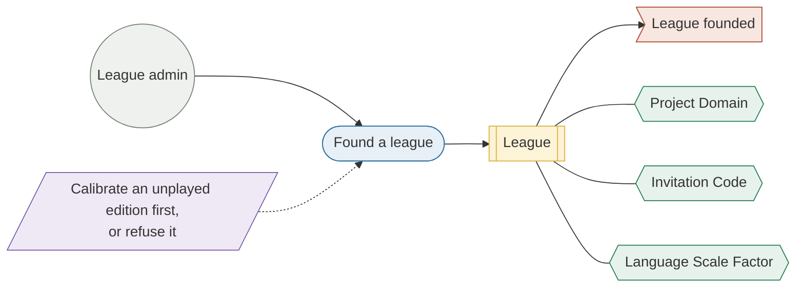
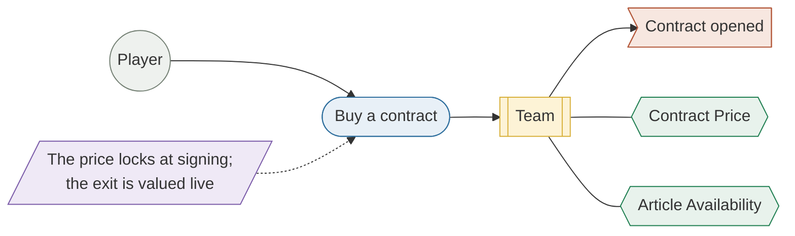
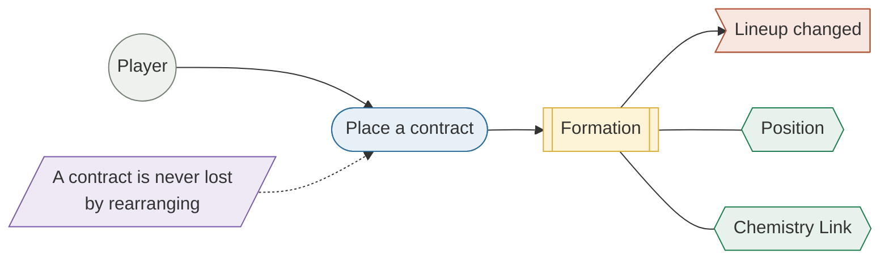
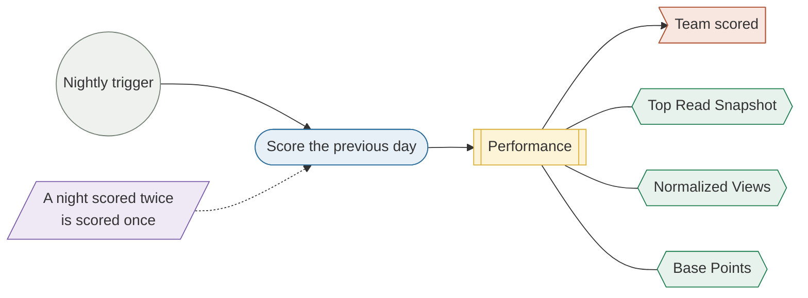

# Requirements

Requirements here are traceable rather than declared. Every functional
obligation points at the document that specifies it and, where it is already
built, at the module that satisfies it. A requirement with no document is a
requirement nobody has agreed on yet, and this page says so rather than
implying otherwise.

The original brief is the Game Design Document,
[FantaWiki Requirements v5.5](../docs/domain/fantawiki-requirements.md). It is
kept as written and is **partly superseded**: its scoring, economy and
tournament sections were reconciled against the locked design, and where it
disagrees with an ADR, the ADR wins.

## Where they came from

The brief was not written in one sitting and then built. The concept was put in
front of people first: described, argued with, and revised on what came back,
before any of it became a requirement. That round is why several of the
obligations below are narrower than the original idea.

### How the idea got to this shape

The starting point was **Polymarket**, a prediction market where people buy and
sell shares in the outcome of a real-world event, so the share price reads as the
crowd's estimate of how likely it is.

The observation this project rests on followed from it: **Wikipedia pageview
volume tracks the same trends a prediction market prices**, and it is free to
read.

Two ideas were dropped on the way to the current one:

| Idea | Why it was dropped |
|---|---|
| A prediction market of open-ended bets, on anything | No way to settle them. An arbitrary bet needs an oracle the project could not build or afford |
| Trends sourced from Google search analytics | The analytics API costs hundreds of dollars a month, which a project running on free tiers cannot justify |

Dropping settlement is what turned the concept from a market into a **game**.
With no bet to adjudicate, scoring had to come from a formula over public
numbers; once scoring is a formula, the format that fits it is fantasy football.
The derivation in full: prediction market, minus settlement, plus a squad.

### What the pitch came back with

**Who:** the university friends who would later play it, and other people from
the university outside that group.

**How:** informally, before anything was built. A conversation, a walkthrough of
the product, then a short spoken set of questions on what they made of the idea
and whether they would play it.

**What came back:**

| Response | Effect on the requirements below |
|---|---|
| Broadly positive. The appeal was using Wikipedia data as a game about current news and trends | The premise was kept |
| A preliminary auction for articles was rejected as tedious. A fantasy-football auction works because the players can be listed; Wikipedia articles cannot be enumerated that way | The market is a fixed price against a live valuation, not an auction |
| Google analytics would be the better data source | Priced out, as above |

### What nobody asked about

**The leaderboard.** Neither group questioned how teams would be ranked against
each other. Total points across the season went unchallenged, and nobody raised
head-to-head fixtures, a tournament, or any alternative.

That is the one worth recording, because a requirement nobody questioned and a
requirement that survived scrutiny look identical once written down.
[The playtest](../quality/playtest.md) separated them: players reported that
nothing felt competitive and asked, unprompted, for the head-to-head format
nobody had thought to raise beforehand.

The auction ran the other way. Rejected at the pitch, then requested by the same
people after a month of play.

The second round of evidence came much later and from real play rather than
opinion. A month on production, in [the playtest](../quality/playtest.md).

## The model, as a wall of notes

Requirements are easier to argue with as a domain model than as a list. Four
stories, told the way they would be told on a wall: **who** asks for something,
**what** they ask for, **which thing** is allowed to say yes, **what became
true** as a result, the **values** the decision is made of, and the **policy**
that answers without being asked.

Each role carries its own outline as well as its own colour: a **circle** acts,
a **rounded box** is what was asked for, a **bracketed box** is what may say
yes, a **flag** is what became true, a **hexagon** is a value it is made of, and
a **slanted box** is a standing rule that answers before anyone asks. The shape
is the legend; the colour only agrees with it.

```mermaid
flowchart LR
  A(("Actor<br/><small>who acts</small>"))
  C(["Action<br/><small>what is asked for</small>"])
  G[["Aggregate<br/><small>what may say yes</small>"]]
  E>"Event<br/><small>what became true</small>"]
  V{{"Value<br/><small>what it is made of</small>"}}
  P[/"Policy<br/><small>the automatic reply</small>"/]

  A --- C --- G --- E --- V --- P

  classDef actor fill:#eef1ee,stroke:#737f73;
  classDef action fill:#e8f0f7,stroke:#2f6f9e;
  classDef agg fill:#fdf3d6,stroke:#d8b03a;
  classDef event fill:#f7e7e0,stroke:#b45a3c;
  classDef value fill:#e8f2ec,stroke:#1e7e50;
  classDef policy fill:#efe9f6,stroke:#7a5aa8;
  class A actor; class C action; class G agg; class E event; class V value; class P policy;

  linkStyle 0,1,2,3,4 stroke-width:0px;
```

### Founding a league

> As a league admin, I want to found a league on the Wikipedia edition my
> friends read, so that we compete over articles we recognise.

A league freezes its **Language Scale Factor** at founding rather than reading
it live, because a later recalibration would silently re-rate every contract
already priced. → [ADR 0002](../docs/adr/0002-language-scale-factor.md)

### Buying a contract

> As a player, I want to buy the articles I think the world is about to read,
> so that my squad scores before anyone else notices.

An article is a **Free Agent** or somebody's, never both, and the price comes
from a smoothed thirty-day average rather than yesterday's spike. What is paid
at signing is fixed there; what the contract is worth on the way out is worked
out again on the day.
→ [ADR 0005](../docs/adr/0005-contract-pricing.md) ·
[ADR 0003](../docs/adr/0003-closed-trading-economy.md)

### Fielding a formation

> As a player, I want to place my contracts where they reinforce each other, so
> that arranging the squad is a decision and not decoration.

Two adjacent articles score extra when Wikipedia itself links them, so where a
contract sits is worth as much as which contract it is.
→ [Chemistry Links](../docs/domain/chemistry-links.md)

### Scoring the night

> As a player, I want yesterday settled before I wake up, so that the standings
> are a fact rather than a calculation I have to trigger.

The actor here is the clock, and that is the whole reason the collector exists:
a day's pageviews are only knowable once the day is over.
→ [What FantasyWiki is](./what-is-fantasywiki.md#the-system-at-a-glance)

### Every requirement, as a story

The wall carries the four stories the rest of the game hangs off. Every
functional requirement below has a story of its own, and the ones the wall does
not draw are told here in words: who wants it, what they want, and what it is
for. The "so that" is the part to argue with, because it is what a requirement
is measured against when two of them pull apart.

| # | Story |
|---|---|
| F1 | As a **player**, I want to sign in with the Google account I already have and stay signed in, so that I never create or remember another password for a game. |
| F1b | As someone **running FantasyWiki on their own machine** without a Google project, I want to register and sign in with a username and a password, so that the local build is playable without registering an OAuth client. |
| F2 | As a **League Admin**, I want to found a league on the edition my friends read. On the wall: [Founding a league](#founding-a-league). |
| F3 | As a **League Admin**, I want my league closed to anyone without its **Invitation Code**, and to decide whether members may pass the code on, so that the league is the group of friends I meant it for. |
| F4 | As a **League Admin**, I want to choose how long the **Season** runs, from two weeks to six months, so that the league lasts as long as my friends will stay interested and ends with a result. |
| F5 | As a **player**, I want to buy an article at a price that reflects its recent month, not yesterday's spike. On the wall: [Buying a contract](#buying-a-contract). |
| F6 | As a **player**, I want a contract I held to its term settled at its live value, gain or loss, so that picking an article before it trends is rewarded and buying one at its peak is a real risk. |
| F7 | As a **player**, I want yesterday scored before I wake up. On the wall: [Scoring the night](#scoring-the-night). |
| F8 | As a **player**, I want adjacent articles that link to each other to score more. On the wall: [Fielding a formation](#fielding-a-formation). |
| F9 | As a **player**, I want to see at a glance whether an article is free, mine, or another team's. On the wall: [Buying a contract](#buying-a-contract). |
| F10 | As a **player**, I want to rearrange my formation without ever losing a contract. On the wall: [Fielding a formation](#fielding-a-formation). |
| F11 | As a **player** whose league has ended, I want to open its standings and my team as they finished, so that the season we played is something we can look back at, not something that vanished. |
| F12 | As a **player** who hit a problem, I want to report it from inside the app and attach a screenshot, so that telling the authors costs me less than giving up. |
| F13 | As a **player** who half-remembers an article, or wants one that links two others, I want to describe it and answer questions until it is found, so that I can buy an article I cannot name. |

## Functional requirements

The same obligations as a table, each pointing at what specifies it and, where
it is already built, at what satisfies it.

| # | The system must… | Specified in | Built in |
|---|---|---|---|
| F1 | Authenticate a person through Google and hold the session in an HTTP-only cookie | [Data flow](../architecture/data-flow.md) | `backend/src/routes/auth.ts` |
| F1b | Also admit a username and password, in the build that has a credential store to check them against | [Auth Modes](../docs/architecture/auth-modes.md) | `routes/passwordAuth.ts` · `indexPassword.ts` |
| F2 | Let a player found a league on any Wikipedia edition that passes the calibration floor | [Wikipedia Language Editions](../docs/domain/language-editions.md) | `services/wikipediaEditions.ts` |
| F3 | Keep a league private unless its founder says otherwise, and admit by code | [League Visibility](../docs/domain/league-visibility.md) · [ADR 0008](../docs/adr/0008-league-invitation-codes.md) | `services/invitationCode.ts` |
| F4 | Bound a season between two weeks and six months | [League Season](../docs/domain/league-season.md) | `services/league.ts` |
| F5 | Price a contract from a smoothed 30-day average rather than a spike | [ADR 0005](../docs/adr/0005-contract-pricing.md) | `model/pricing.ts` |
| F6 | Keep the money supply closed: no stipend, no fee, gains and losses settled at expiry | [ADR 0003](../docs/adr/0003-closed-trading-economy.md) · [ADR 0007](../docs/adr/0007-derived-team-credits.md) | `workflows/contractSettlement.ts` |
| F7 | Score each team on the previous day's pageviews, once, for every league | [Scoring & Economy System](../docs/domain/scoring-system.md) | `scoring-collector/` + `services/scoring.ts` |
| F8 | Award chemistry for adjacent articles that link to each other on Wikipedia | [Chemistry Links](../docs/domain/chemistry-links.md) | `services/performance.ts` |
| F9 | Show a player which articles are free, theirs, or another team's | [Article Availability](../docs/domain/article-availability.md) | `model/contract.ts` |
| F10 | Never lose a contract when a formation changes | [Lineup Rules](../docs/domain/lineup-rules.md) | `services/lineup.ts` |
| F11 | Keep a league readable after it ends, and never delete what someone can still read | [League Lifecycle](../docs/domain/league-lifecycle.md) | `services/league.ts` |
| F12 | Let a player report a problem without leaving the app | [Problem Reports](../docs/architecture/problem-reports.md) | `services/problemReport.ts` |
| F13 | Answer questions about an article without naming it, as a guessing game | [ADR 0006](../docs/adr/0006-article-genie.md) · [Article Genie](../docs/architecture/article-genie-llm.md) | `services/articleGenie.ts` |

## Definition of done

A requirement is done when **all** of the following hold, and not before:

1. **The rule is written down once**, in the doc the table above points at, in
   the vocabulary of [`CONTEXT.md`](../CONTEXT.md).
2. **A test states it.** An automated test asserts the observable condition in
   the table below, at the tier that owns the rule: a backend rule in the
   backend suite, which runs on both persistence targets, and a rule that lives
   in the browser in the frontend suite.
3. **The contract is described.** Every route it added or changed is in
   `backend/openapi.yaml`, and the suite that gates the spec against the mounted
   routes passes.
4. **`ci-cd / success` is green** on the pull request: format, lint, typecheck,
   audit and every suite.
5. **It is on `master`**, which means deployed to production, and released if
   the change was a `feat` or a `fix`
   ([Release Process](../docs/development/release-process.md)).

The table is condition 2, requirement by requirement: what has to be observably
true, and the test that shows it. Where the test covers less than the
requirement says, the gap is named rather than rounded up.

| # | Done when | Shown by | Gap |
|---|---|---|---|
| F1 | A sign-in sets a `session_token` cookie whose JWT the `/api/*` guard accepts, and a request without it is refused with 401 | `routes/index.spec.ts` · `integration/devAuth.integration.test.ts` | The Google callback's own cookie is asserted through the shared session code, not by a test of the callback |
| F1b | Registering and signing in with a password mints the same session, a wrong password and an unknown user answer alike, and no password is stored in clear | `integration/passwordAuth.password.test.ts` · `auth/passwordHash.spec.ts` | |
| F2 | Every live edition is offered; one below the calibration floor is refused and writes nothing; one never played is calibrated before its league exists | `integration/languageScaleCalibration.integration.test.ts` · `wikipediaEditions.spec.ts` | |
| F3 | A private league turns away anyone without its code, admits the right code however it was typed, and one league's code opens no other | `integration/leagueVisibility.integration.test.ts` · `integration/leagueCreation.integration.test.ts` | Visibility is a required field, so "private unless the founder says otherwise" is the form's default, which no test asserts |
| F4 | Only the offered season lengths are accepted, and a league runs for exactly the length chosen | `integration/leagueCreation.integration.test.ts` | The two ends, two weeks and six months, are not asserted on their own |
| F5 | A price is computed from the 30-day average alone, and a purchase with no 30-day average is refused rather than priced from one day | `contract.spec.ts` · `integration/contract.integration.test.ts` | The averaging arithmetic itself has no dedicated test |
| F6 | An expired contract settles at the live price, at a profit or a loss, with nothing deducted, and a team with no contracts holds exactly the starting budget | `integration/contractSettlement.integration.test.ts` · `repositories/conformance/derivedCredits.integration.test.ts` | |
| F7 | Ingesting the same team and day twice leaves one performance, recomputed, not two | `integration/scoring.integration.test.ts` · `repositories/conformance/performanceRepository.integration.test.ts` · `CollectorTest.kt` | That the nightly run picks the previous UTC day is structural, not asserted |
| F8 | Two adjacent articles that link both ways are Excellent, one way Good, not at all Weak, and each level adds its points | `ChemistryTest.kt` · `integration/scoring.integration.test.ts` · `scoring.spec.ts` | |
| F9 | Every owner and viewer pair resolves to Free Agent, owned by the viewer, or owned by another team, and the article page shows which | `contractLifecycle.spec.ts` · `frontend: articleDetail/useArticleOwnership.spec.ts` | |
| F10 | Changing formation benches a contract that no longer fits a position rather than dropping it | `frontend: formation/lineupMutations.spec.ts` · `integration/lineup.integration.test.ts` | |
| F11 | A league whose season is over still resolves, and a league is deleted only when its last member leaves | `integration/joinByCode.integration.test.ts` · `integration/leagueLifecycle.integration.test.ts` | |
| F12 | A report files a GitHub issue carrying the pseudonymous player id and never an email, and a failure falls back to a pre-filled link without leaving the app | `integration/problemReport.integration.test.ts` · `integration/reportsRoute.integration.test.ts` · `frontend: useProblemReport.spec.ts` | |
| F13 | A turn returns a question and the surviving candidate ids, and the prompt refers to candidates by id alone | `articleGenie.spec.ts` · `integration/genieRoute.integration.test.ts` | That a generated question never names the article rests on the prompt and the ids-only response, since the model is stubbed in tests |

Backend paths are under `backend/src/tests/`, frontend ones under
`frontend/src/tests/`, and the Kotlin ones under `scoring-collector/src/test/`.

## Quality attributes

These are the non-functional requirements: the properties the architecture was
actually shaped by, as opposed to what it does. Each one names
the mechanism that enforces it, because a quality attribute with no mechanism is
an aspiration.

### Portability of persistence

**The obligation.** The system must be able to change database without
rewriting its business logic.

**The mechanism.** Every persistence contract is an interface under
`repositories/`, each store is one implementation beneath it
(`repositories/d1/` and `repositories/mongo/`), and `composition.ts` is the only
module allowed to choose one, from a binding. The rule is enforced by ESLint:
nothing under `services/`, `routes/` or `tests/` may import either
implementation directory, so the seam cannot erode by accident.

**The evidence.** This is the one quality attribute here that has been
discharged rather than argued. MongoDB was added as a second target with no
change above the repository layer, and the conformance suite in
`tests/repositories/conformance`, written against the interfaces and nothing
below them, became its acceptance criteria unchanged. Both targets run the
same suite on every `./gradlew check`, so the second implementation cannot rot
while the first one is the one being used.

What the exercise cost is worth recording, because it is what a portability
claim usually hides: the interfaces held, and everything that had to be
re-derived was a guarantee the relational store had been giving away for free
(single-statement atomicity, a cascade on delete, a view). Each one is now
stated explicitly on the document side, and named in
[the data model](../architecture/data-model.md).

→ [Persistence Targets](../docs/architecture/persistence-targets.md) ·
[Backend Architecture](../docs/architecture/backend-architecture.md)

### Determinism of scoring

**The obligation.** Re-running a night must produce the same standings.

**The mechanism.** Ingest is an idempotent upsert keyed on `(teamId, date)`, and
the formation used for a day is frozen into the performance row as an immutable
snapshot rather than read back from the current lineup. A player who rearranges
their team today cannot change what they scored yesterday.

→ [Nightly Scoring Pipeline](../docs/architecture/scoring-pipeline.md)

### One formula, one language

**The obligation.** A scoring rule must not be implemented twice.

**The mechanism.** The collector is a JVM process and the backend is a
TypeScript Worker, so the temptation to compute points on both sides is real and
permanent. It is closed off by contract: the collector posts raw facts only, and
`model/scoring.ts` is the sole implementation of the curve.

### Cost that scales with use

**The obligation.** A handful of players must cost nothing at all, and a great
many must cost something that rises with them rather than ahead of them.

**The mechanism.** Almost nothing is always-on and almost nothing is bought by
capacity: a Worker rather than a server, GitHub Actions rather than a scheduler
that has to be running in order to schedule.

The database is the one place that argument is split, and it is worth stating
plainly rather than smoothing over. D1, which the Cloudflare deployment runs
on, is billed by rows read and written, the same shape as the Worker. A
MongoDB cluster is capacity bought in advance: free at the size the game is
played at, and the first line of the bill that would become a decision if it
grew. The repository seam is what keeps that a deployment choice rather than an
architectural one.

At the numbers the game is played at today the whole system lands inside the
free tiers with room to spare. Past them, every line of the bill but the
cluster is per request and per row, so it follows the league count up a slope
rather than a staircase: there is no size at which the architecture has to be
bought again.

The one quantity that does not grow with players is the nightly fan-out to
Wikimedia, which grows with distinct articles instead. It is throttled, and it
is deduplicated by article across every team in every league, so a thousand
squads holding the same article cost one request. That number is costed
explicitly rather than assumed away.

→ [Nightly Scoring Pipeline](../docs/architecture/scoring-pipeline.md)

### Testability

**The obligation.** A rule must be testable without a browser and without a
network.

**The mechanism.** Tiers with an explicit rule about which layer each may name,
a seeding helper that goes through the production write path instead of raw
queries, and a real database reset before every backend test: every collection
emptied and re-seeded on MongoDB, the schema dropped and the migrations
replayed on D1.

→ [Test strategy](../quality/testing.md)

### Approachability for a new contributor

**The obligation.** Someone should be able to run the whole thing without
obtaining a single credential.

**The mechanism.** `./gradlew noGenie` against published images, a dev sign-in
route that refuses to exist outside the local environment, and MSW standing in
for the API in the browser. Only the Article Genie asks for a credential, and
only the two tasks that name it.

→ [Running FantasyWiki in Docker](../docs/development/docker-local-dev.md)

## Constraints

| Constraint | Consequence |
|---|---|
| Wikimedia's API etiquette | The nightly fan-out is throttled and identifies itself with a user agent; the collector holds no persistent state |
| Pageviews are published in arrears | Scoring can only ever be a batch over a completed UTC day |
| Cloudflare Workers CPU budget | Ingest is chunked, and heavy work is pushed into a Workflow rather than a request |
| A Worker owns its sockets per request | The MongoDB client is built per request and never cached in a module. A cached one breaks every request after the first, and does it silently |
| Mongo transactions are snapshot-isolated, not serializable | A guarded write also writes the league it is guarding against, so the losing transaction is retried rather than committed against a stale snapshot |
| Multi-document transactions need a replica set | Even a local run is a single-node replica set, and the test suite starts one of its own |
| The MongoDB driver reaches for `node:net` and `node:tls` | No Cloudflare deployment runs on MongoDB: the driver is aliased out of the Worker bundle, and the Mongo target has a wrangler config of its own |
| SQLite via D1 | `ALTER TABLE` cannot add a `NOT NULL UNIQUE` column, which is visible in more than one migration |
| AGPL-3.0 | The deployed service must carry its source link |

## Related

- [What FantasyWiki is](./what-is-fantasywiki.md): the game and its four systems
- [Architecture overview](../architecture/): how the obligations above are arranged in code
- [Technologies](./technologies.md): what the quality attributes above were satisfied with
- [The playtest](../quality/playtest.md): a month of real play against these obligations
- [FantaWiki Requirements v5.5](../docs/domain/fantawiki-requirements.md): the original brief
