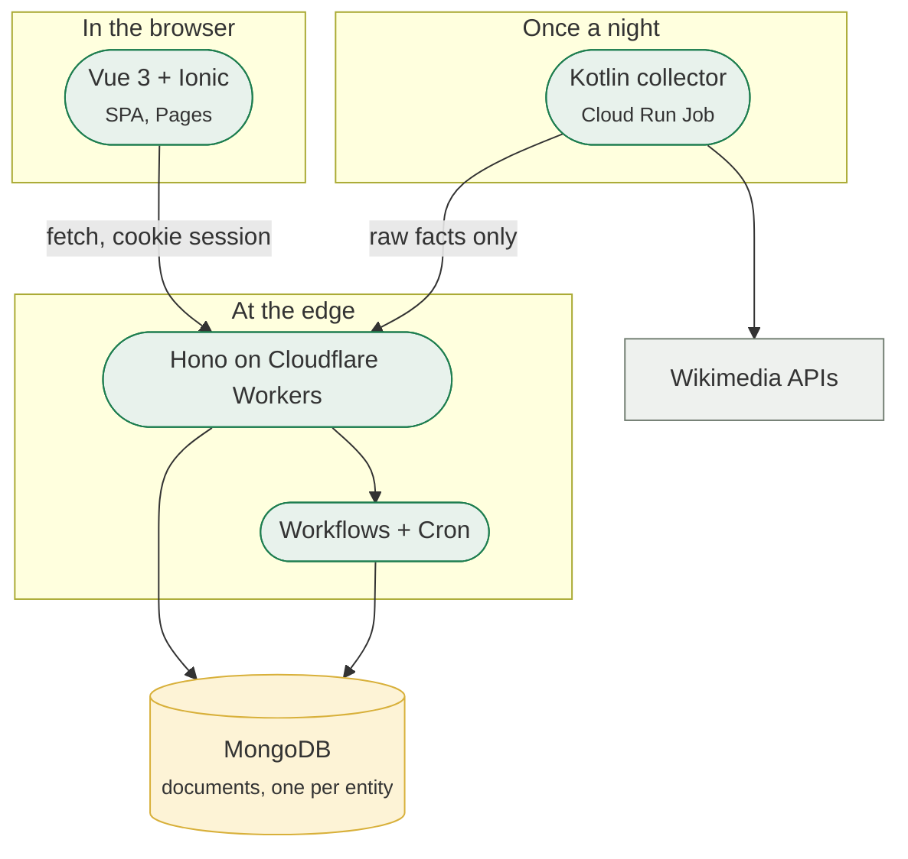

# Technologies

Nothing here was chosen because it is popular. Each entry names what it was
picked over and the constraint that settled it — usually one of three: the
system must cost nothing to run at the size it is played at, a scoring rule must
exist in exactly one place, and a new contributor must be able to start it
without obtaining a credential.

## The shape those constraints forced

## The runtime

**Cloudflare Workers**, over a container on a rented VM. The deciding property
is that nothing is always-on: a league nobody opened today costs nothing, and
there is no instance to keep warm between the nightly run and the morning. The
price is a real one — a request has a CPU budget, which is why ingest is chunked
and the settlement sweep runs as a Workflow rather than inside a request.

**Hono**, over Express or a bare `fetch` handler. Express assumes Node's
`http`, which the Workers runtime does not have; a bare handler would mean
writing routing and middleware. Hono is built for the runtime and its JWT and
OAuth middleware are the two pieces of infrastructure this project would
otherwise have written itself.

## The database

**MongoDB**, over a relational store, and over keeping only the edge-native one
the project started with. Three properties decided it.

The first is that it runs anywhere — a managed cluster, or a single-node replica
set on a laptop — where the edge-native store exists only inside one vendor's
platform, and a
database that can only be reached from a Worker is a database the test suite,
the local run and any future host all have to work around. The second is that
the model changes without a deployment step: a field added to a league is
written by the repository that writes it, and there is no migration to replay
before the code that needs it can ship. The third is that the aggregation
pipeline is where the one derivation this system has belongs — a team's balance
is a `$lookup` over its contracts, computed on read, so no document holds a
number that could disagree with the ledger it came from.

The price is paid in the two places a relational store would have charged
nothing. Transactions are snapshot-isolated rather than serializable, so every
guarded write has to also write the league document it is guarding against, and
the loser of the race is retried. And the cascade a foreign key would have
given for free is spelled out by hand when a league is deleted. Both are
written down, with the failure each one prevents.
→ [Data model](../architecture/data-model.md)

**Cloudflare D1** is kept as the second implementation, and it is what the
Cloudflare deployment runs on: SQLite billed by rows read and written rather
than by an instance sized in advance, which is the same always-on argument as
the Worker. Its own price is visible in the migrations — SQLite cannot add a
`NOT NULL UNIQUE` column to an existing table.

Two targets rather than one is not hedging. It is the evidence for the claim the
architecture makes everywhere else: every persistence contract is an interface,
one module chooses the implementation, and the same conformance suite is run
against both on every `./gradlew check`.
→ [Persistence Targets](../docs/architecture/persistence-targets.md) ·
[Backend Architecture](../docs/architecture/backend-architecture.md)

## The client

**Vue 3 with Ionic**, over plain Vue or React Native. The game is played on a
phone more than a desk, and Ionic supplies the platform-shaped navigation and
components for a web build that can also be packaged with Capacitor — without
the second codebase a native framework would have meant.

**Pinia and TanStack Query**, deliberately as two different things. Pinia holds
what the app knows about itself; TanStack Query holds what the server knows and
owns the caching, refetching and invalidation that hand-rolled store actions get
wrong. The split is the rule, and it is written down.
→ [Frontend](../architecture/frontend.md)

**MSW**, so the frontend can be developed and tested with no backend running at
all. It is also why the test suite can assert on a request that was never sent
over a network.

## The scoring collector

**Kotlin on Cloud Run Jobs**, over doing the nightly work in the Worker. A
night's scoring is thousands of Wikimedia calls under an etiquette limit, which
is exactly the shape a request-scoped CPU budget refuses. A scheduled job that
exists only while it runs is the same always-on argument again, one platform
over.

The rule that keeps this from splitting the game in two is that **the collector
computes nothing**: it posts raw facts, and the single implementation of the
scoring curve lives in the TypeScript `model/` package. Two runtimes, one
formula.
→ [ADR 0004](../docs/adr/0004-scoring-engine-platform.md) ·
[Nightly Scoring Pipeline](../docs/architecture/scoring-pipeline.md)

## The workspace

**A Gradle-orchestrated monorepo** over three separate repositories or a bare
npm workspace. `dto/` and `model/` are consumed by both the frontend and the
backend, so a change to a wire shape has to be able to fail both sides in one
run — which it does, because one `./gradlew check` builds everything. Gradle
rather than npm workspaces because one of the four packages is a JVM project.

**TypeScript everywhere it can be**, including the shared packages, so that the
API's shapes are checked at both ends of the wire rather than agreed by
convention. What TypeScript cannot check — that the HTTP surface matches what is
documented — is checked by a test instead.
→ [OpenAPI spec](https://github.com/FantasyWiki/FantasyWiki/blob/master/docs/agents/openapi-spec.md)

## Everything that runs the project

| What | Used for | Chosen over |
|---|---|---|
| A MongoDB replica set | Persistence, and the multi-document transactions the guarded writes are | A single node, which cannot run a transaction at all |
| Cloudflare Pages | Frontend hosting, per-branch previews | A static bucket with a CDN in front |
| Cloudflare Workflows | The settlement sweep, which outlives a request | A long-running request, which the CPU budget refuses |
| Cloudflare Cron Triggers | Starting the nightly sweep | An external scheduler that has to be running to schedule |
| Workers AI | The Article Genie's questioning | A hosted LLM API, which would be the project's only paid dependency |
| GitHub Actions | CI on every branch, deploys on `master` and `dev` | A CI service that has to be provisioned separately |
| Vitest + `@cloudflare/vitest-pool-workers` | Backend tests in the real runtime | Node-based tests against a mocked runtime |
| Docker Compose | Running the whole stack with no credentials | A page of setup instructions |
| VitePress | This documentation site | A generated API-doc site with no room for prose |

## Related

- [Architecture overview](../architecture/) — how these pieces are arranged
- [Deployment](../architecture/deployment.md) — where each one runs
- [Requirements](./requirements.md) — the obligations that decided them
- [ADR 0004](../docs/adr/0004-scoring-engine-platform.md) — the platform decision written up in full
