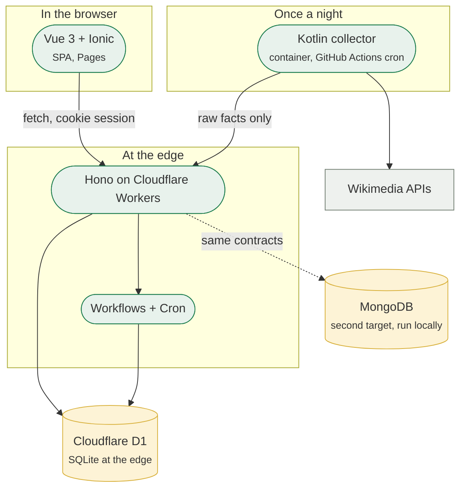

# Technologies

Nothing here was chosen because it is popular. Each entry names what it was
picked over and the constraint that settled it, usually one of three: the
system must cost nothing to run at the size it is played at, a scoring rule must
exist in exactly one place, and a new contributor must be able to start it
without obtaining a credential.

## The shape those constraints forced

## The runtime

**Cloudflare Workers**, over a container on a rented VM. The deciding property
is that nothing is always-on: a league nobody opened today costs nothing, and
there is no instance to keep warm between the nightly run and the morning. The
price is a real one, a request has a CPU budget, which is why ingest is chunked
and the settlement sweep runs as a Workflow rather than inside a request.

**Hono**, over Express or a bare `fetch` handler. Express assumes Node's
`http`, which the Workers runtime does not have; a bare handler would mean
writing routing and middleware. Hono is built for the runtime and its JWT and
OAuth middleware are the two pieces of infrastructure this project would
otherwise have written itself.

## The database

**Cloudflare D1**, over a managed database on a rented instance. It is what the
deployment runs on, and the property that decided it is the one that decided the
runtime: D1 is billed by rows read and written rather than by an instance sized
in advance, so a league nobody opened today costs nothing and there is nothing to
keep warm overnight. It also lives inside the platform the Worker already runs
in, so a query is a binding rather than a connection held open across a network.

Its price is visible in the migrations. SQLite cannot add a `NOT NULL UNIQUE`
column to an existing table, so several of them arrive in two steps, and the one
derivation this system has — a team's balance — is a view over the contracts
ledger rather than a column that could disagree with it.
→ [ADR 0007](../docs/adr/0007-derived-team-credits.md)

**MongoDB is the second implementation, and it is what makes the first one
replaceable.** It is not what production runs: `wrangler.jsonc` aliases the
driver away, so the deployed Worker neither carries it nor could reach it. It
runs locally, against a single-node replica set, from its own
`wrangler.mongo.jsonc` — a config kept separate because one that can never be
deployed does not belong in the one that deploys.

It earns its place by being a genuinely different shape: documents instead of
rows, an aggregation pipeline instead of a view, and transactions that are
snapshot-isolated rather than serializable, which is why every guarded write also
writes the league document it guards against. Nothing above the repository layer
knows any of that.

Two targets rather than one is not hedging. It is the evidence for the claim the
architecture makes everywhere else: every persistence contract is an interface,
one module picks the implementation, and the same conformance suite runs against
both on every `./gradlew check`. A store that can be swapped in a test run is a
store that can be swapped when the bill changes — which is what keeps the choice
of vendor a decision rather than a dependency.
→ [Persistence Targets](../docs/architecture/persistence-targets.md) ·
[Backend Architecture](../docs/architecture/backend-architecture.md) ·
[Data model](../architecture/data-model.md)

## The client

**Vue 3 with Ionic**, over plain Vue or React Native. The game is played on a
phone more than a desk, and Ionic supplies the platform-shaped navigation and
components for a web build that can also be packaged with Capacitor, without
the second codebase a native framework would have meant.

**Pinia and TanStack Query**, deliberately as two different things. Pinia holds
what the app knows about itself; TanStack Query holds what the server knows and
owns the caching, refetching and invalidation that hand-rolled store actions get
wrong. The split is the rule, and it is written down.
→ [Frontend](../architecture/frontend.md)

**MSW**, so the frontend can be developed and tested with no backend running at
all. It is also why the test suite can assert on a request that was never sent
over a network.

## The scoring collector

**Kotlin/JVM in a container, on a GitHub Actions cron**, over doing the nightly
work in the Worker. A night's scoring is thousands of Wikimedia calls under an
etiquette limit, and a Worker invocation is allowed fifty subrequests — no paid
tier removes that ceiling, and a Worker would be V8 again, so it would add no
second runtime either. A scheduled job that exists only while it runs is the same
always-on argument, one platform over; Actions is already where this repository's
automation lives, so it costs no new account.

The rule that keeps this from splitting the game in two is that **the collector
computes nothing**: it posts raw facts, and the single implementation of the
scoring curve lives in the TypeScript `model/` package. Two runtimes, one
formula.
→ [ADR 0004](../docs/adr/0004-scoring-engine-platform.md) ·
[Nightly Scoring Pipeline](../docs/architecture/scoring-pipeline.md)

### Why the JVM share is small

The split between the two platforms falls short of the guideline that the
dominant one stay under three quarters of the project: the TypeScript side is
most of the code, and the collector is a small module beside it. That is the
consequence of a design decision, and it is the same decision that keeps the
two platforms coherent.

**The second platform was designed to be larger.** The first version of
[ADR 0004](../docs/adr/0004-scoring-engine-platform.md), on 2026-06-21, had the
nightly engine read contracts and write scores and standings straight to D1,
and compute base points, chemistry and a weekly tournament itself, in a runtime
of its own. Most of the game's scoring would have lived there.

**It was cut in two steps, both on purpose.** By 2026-07-13 the engine posted to
two backend endpoints instead of writing the database, because a second writer
would have to carry every rule about what a valid row is. Then the arithmetic
went too. The scoring rules were already implemented in `model/`, in
TypeScript, because the Worker prices contracts with the same curve, and a
Kotlin engine that computed points would have been a second implementation of
them, kept in step by hand and checked by golden vectors. On 2026-07-14 commit
`d1910f0` moved all of it to `model/scoring.ts`, deleted the Kotlin `Scoring.kt`,
and left the collector a fetcher that posts raw facts.

**The two platform criteria pull against each other here, and the project chose
coherence.** Core entities that span platforms should be defined so as to
minimise duplication; a large second platform, in a system whose rules already
live on the first, is duplication by construction. Keeping one formula in one
language is what made the collector small, and moving code to the JVM to raise
its share would bring back exactly the second copy the cut removed.

Work that needs a long-running process rather than a request, such as the daily
challenges planned next, belongs on the JVM for the reason the collector does,
and the share will move with it.

## The workspace

**A Gradle-orchestrated monorepo** over three separate repositories or a bare
npm workspace. `dto/` and `model/` are consumed by both the frontend and the
backend, so a change to a wire shape has to be able to fail both sides in one
run, which it does, because one `./gradlew check` builds everything. Gradle
rather than npm workspaces because one of the four packages is a JVM project.

**TypeScript everywhere it can be**, including the shared packages, so that the
API's shapes are checked at both ends of the wire rather than agreed by
convention. What TypeScript cannot check, that the HTTP surface matches what is
documented, is checked by a test instead.
→ [OpenAPI spec](https://github.com/FantasyWiki/FantasyWiki/blob/master/docs/agents/openapi-spec.md)

## Everything that runs the project

| What | Used for | Chosen over |
|---|---|---|
| Cloudflare D1 | Persistence in production, billed by rows rather than by an instance | A managed database on a rented instance, always on and always billed |
| A MongoDB replica set | The second persistence target, run locally, and the transactions its guarded writes need | Staying on one store, which would leave the repository boundary untested |
| Cloudflare Pages | Frontend hosting, per-branch previews | A static bucket with a CDN in front |
| Cloudflare Workflows | The settlement sweep, which outlives a request | A long-running request, which the CPU budget refuses |
| Cloudflare Cron Triggers | Starting the nightly sweep | An external scheduler that has to be running to schedule |
| Workers AI | The Article Genie's questioning | A hosted LLM API, which would be the project's only paid dependency |
| GitHub Actions | CI on every branch, deploys on `master` and `dev` | A CI service that has to be provisioned separately |
| Vitest + `@cloudflare/vitest-pool-workers` | Backend tests in the real runtime | Node-based tests against a mocked runtime |
| Docker Compose | Running the whole stack with no credentials | A page of setup instructions |
| VitePress | This documentation site | A generated API-doc site with no room for prose |

## Related

- [Architecture overview](../architecture/): how these pieces are arranged
- [Deployment](../architecture/deployment.md): where each one runs
- [Requirements](./requirements.md): the obligations that decided them
- [ADR 0004](../docs/adr/0004-scoring-engine-platform.md): the platform decision written up in full
