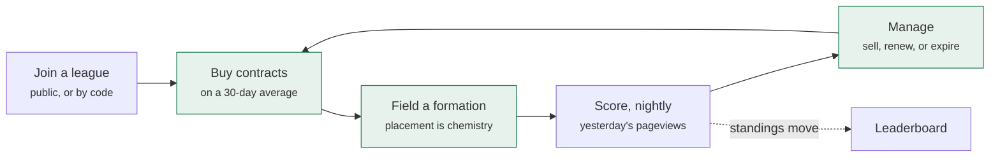
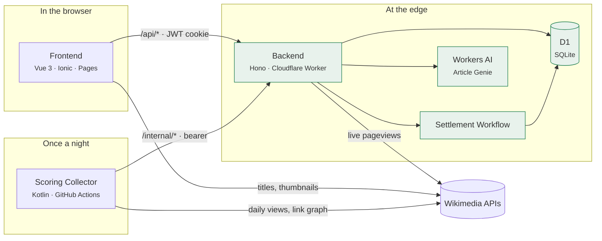
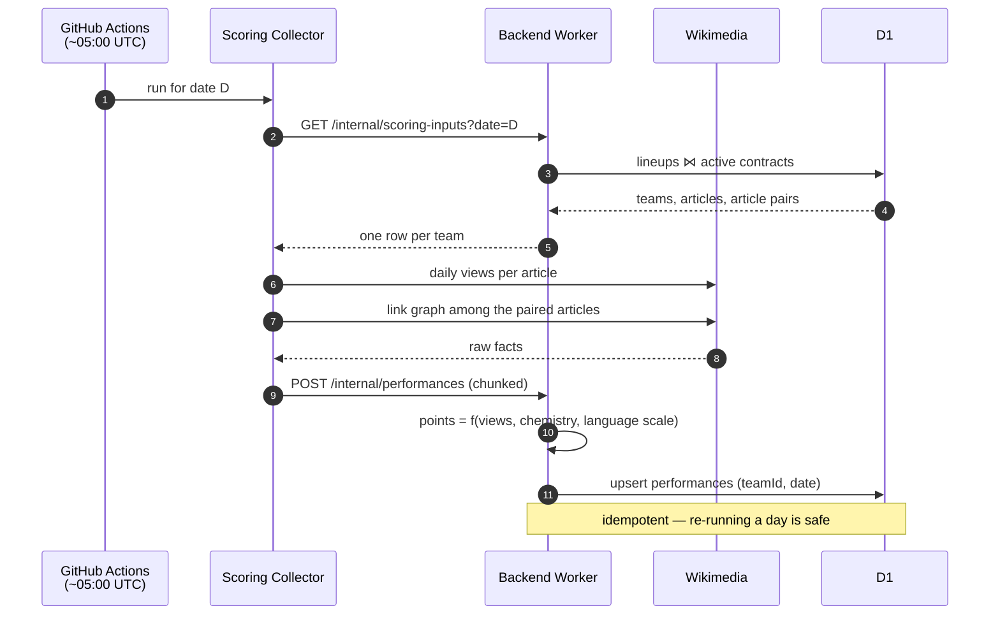

# What FantasyWiki is

Every day, millions of people read Wikipedia. A footballer scores, a country
makes the news, a film releases — and the pageviews spike.

FantasyWiki turns that into a fantasy league. A player joins a league, gets a
budget, buys **article contracts**, arranges them into a **formation**, and
scores as the world reads. The season runs for weeks; the squad never stops
needing management.

This page is the orientation layer. It says what the pieces are and where each
one is specified — it does not restate any of the rules, because every rule in
this system is written down exactly once, under [`domain/`](../docs/).

## The loop a player is in

Four decisions, repeated: what to own, where to place it, when to let it go, and
which league to spend the effort in.

## The four systems it is built from

Each of these is a body of rules with one canonical document. If two pages ever
disagree about one of them, the one linked here is the one that is right.

| System | The question it answers | Canonical |
|---|---|---|
| **Scoring** | How a day's pageviews become points, and why doubling readers is a step rather than a jackpot | [Scoring & Economy System](../docs/domain/scoring-system.md) |
| **Chemistry** | Why two articles score extra when they sit side by side, and what "side by side" means | [Chemistry Links](../docs/domain/chemistry-links.md) |
| **The economy** | What a contract costs, what it pays back, and why the money supply is closed | [ADR 0003](../docs/adr/0003-closed-trading-economy.md) · [ADR 0005](../docs/adr/0005-contract-pricing.md) |
| **Leagues** | Who can join, when a season starts and ends, and what happens to a league nobody plays any more | [League Lifecycle](../docs/domain/league-lifecycle.md) · [League Season](../docs/domain/league-season.md) |

## The system at a glance

Five deployable pieces and one shared vocabulary. The frontend and the Worker
share their types through two framework-free packages; the nightly collector
shares nothing with either but an HTTP contract and a secret.

The layers inside each of those, and the seams between them, are in the
[architecture overview](../architecture/). The one worth knowing before reading
any further is why the collector exists at all.

## Why it needs a nightly batch at all

The obvious design scores a team when someone opens the app. It does not work,
for a reason worth stating plainly: **a day's pageviews are only knowable after
the day is over.** Wikimedia publishes them in arrears, the same figure for
everybody, and no amount of asking earlier produces a number.

So scoring is a batch over yesterday, run once, for every team in every league.

Two properties keep this honest, and both are architectural rather than
incidental:

**The collector computes nothing.** It posts raw facts — views per article, the
resolved level of each chemistry link — and the Worker turns them into points
using the single implementation in `model/scoring.ts`. One scoring formula, in
one language, so the JVM and the TypeScript runtimes cannot drift apart.

**The collector knows nothing about the game.** No formation, no position, no
language calibration. The backend resolves the formation into a flat list of
article *pairs* and hands them over. Adding a formation touches one enum.

The full pipeline, including the failure modes and the cost analysis, is in
[Nightly Scoring Pipeline](../docs/architecture/scoring-pipeline.md).

## Where the words come from

The domain has a vocabulary and it is enforced: *Top Read Snapshot*, *Article
Availability*, *Chemistry Link*, *Free Agent*, *Owner Team*. These are not
stylistic preferences — they are the terms the code, the commit messages and
these docs all use, and each one has an "avoid" list of the synonyms that would
otherwise creep in.

That glossary is [`CONTEXT.md`](../CONTEXT.md), and it is canonical. A concept
that does not have a name there does not yet have a name. It is rendered, term
by term, on [the vocabulary](./glossary.md).

## Where each rule is written down

The documentation under [`docs/`](../docs/) is grouped by what would have to
change for a document to become wrong:

- `domain/` — a **game rule** changed
- `architecture/` — a **refactor** changed it
- `development/` and `deployment/` — a **tool or an environment** changed
- `adr/` — nothing changes it; a decision record is immutable, and when an ADR
  disagrees with any other document, the ADR wins

Those documents live in the repository, beside the code. Pages like this one, the
[architecture overview](../architecture/) and the
[data flow](../architecture/data-flow.md) do not: they carry diagrams and
orientation, and deliberately carry no rules, so there is nothing on them that
can contradict the repository. Which is which, and why, is in
[About this site](../about-this-site.md).

## Related

- [Architecture overview](../architecture/) — the containers and the layers
- [Requirements](./requirements.md) — what the system is obliged to do, and how well
- [Technologies](./technologies.md) — what it is built on, and what each choice was made over
- [Interface design](../architecture/interface.md) — the screens the loop is played through
- [What we learned](../quality/conclusions.md) — whether it did what it set out to
- [The Docs Atlas](../index.md#the-docs-atlas) — the whole documentation tree as a graph
- [Product vision](../PRODUCT.md) — the audience and the tone
