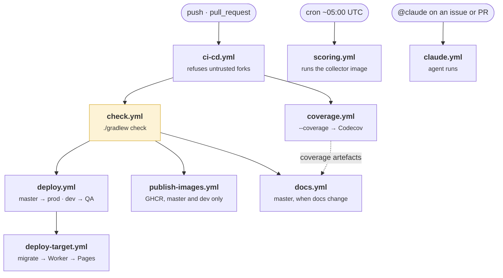

# Continuous delivery

Nine workflows, one entry point. `ci-cd.yml` fires on every push and pull
request and fans out to the rest; everything else is either called by it or runs
on a schedule of its own.

## The graph

**`check.yml` is the gate and the only one.** It runs `./gradlew check`, which
runs format, lint, test and audit across both Node packages and the Kotlin
module. Everything downstream, deploys, images, is `needs: ci-cd`, so nothing
ships from a revision that did not pass.

The dispatcher job in front of it exists to decide whether a pull request is
allowed to run with secrets at all: same-repository branches and Dependabot yes,
arbitrary forks no.

## What "green" means

| Check | Fails when |
|---|---|
| `format` | Prettier or ktlint would rewrite a file |
| `lint` | ESLint has any warning at all in the backend (`--max-warnings 0`) |
| `typecheck` | `tsc --noEmit` disagrees, including the separate test tsconfig |
| `test` | Any suite in any package fails |
| `audit` | A dependency advisory crosses the configured threshold |
| Codecov | Project line coverage drops below 70% |

Codecov gates the project total only. Patch coverage is off: a small fix to a
hard-to-reach branch should not be blocked for lowering a ratio it barely moves.

## Conventions the pipeline depends on

**Conventional Commits**, enforced by a `commit-msg` git hook installed by
Gradle, together with a `pre-commit` hook running `ktlintCheck`. The commit type
is also the branch prefix, `feat/`, `fix/`, `refactor/`, so a branch name says
what kind of change it carries.

**npm scripts are camelCase with no separators**, `formatfix`, not
`format:fix`. Gradle's node plugin reads `:` as subproject notation and `_` as a
space, so the naming is a build constraint rather than a preference.
→ [NPM Script Naming](../docs/development/npm-script-naming.md)

**Renovate** opens dependency updates on `renovate/*` branches, which are
checked and never deployed. **Mergify** handles the queue.

## The scheduled jobs

Two things run without anyone asking.

**Nightly scoring**, ~05:00 UTC, roughly two hours after Wikimedia publishes
the previous UTC day, a buffer wide enough to absorb GitHub's cron jitter. It
runs the collector image from GHCR against production only, keyed for
concurrency on the date so two runs never score the same day at once.

**Contract settlement**, 07:00 UTC, a Cloudflare Cron Trigger inside the
Worker, which starts a durable Workflow. It is not a GitHub job: it has to
survive interruption and resume, which is what Workflows are for. The two-hour
gap after scoring is deliberate and neither job may be moved alone, a contract
expiring today is still scorable for yesterday, and settling it first would cost
that team its last day ([Contract Settlement](../docs/architecture/contract-settlement.md)).

## The one job that is conditional

`docs.yml` publishes the technical documentation, and it is the only job in the
graph that a push can skip. The dispatcher asks whether the push touched
anything the site is built from, `docs/`, the charter files, or the two
workflows that feed it, and the job runs only if the answer is yes, or if the
question could not be answered. Everything else here runs unconditionally,
because everything else ships code.

→ [About this site](../about-this-site.md): what that job actually does

## Related

- [Deployment](../architecture/deployment.md): what each of these jobs deploys
- [Test strategy](./testing.md): what `check` actually runs
- [About this site](../about-this-site.md): the documentation build
- [Deploy Strategy](../docs/deployment/deploy-strategy.md)
