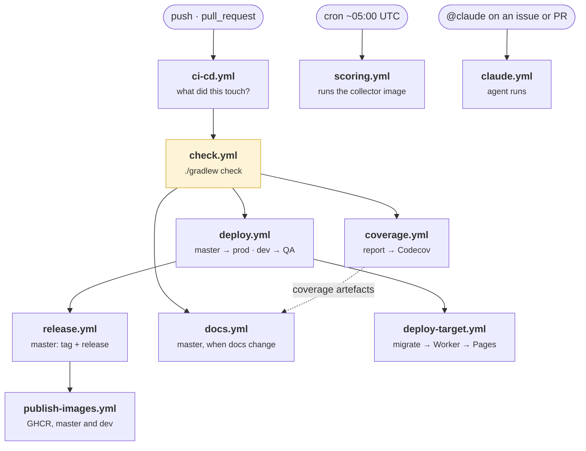

# Continuous delivery

Ten workflows, one entry point. `ci-cd.yml` fires on every push and pull
request and fans out to the rest; everything else is either called by it or runs
on a schedule of its own.

## The graph

**`check.yml` is the gate and the only one.** It runs format, lint, typecheck,
audit and every test suite across both Node packages and the Kotlin module.
Everything downstream, deploys, releases, images, waits for it, so nothing
ships from a revision that did not pass. Its aggregate, `ci-cd / success`, is
the one status the `master` ruleset requires.

**The backend suite is a matrix.** One leg runs it against D1, the other against
MongoDB, on separate runners and with `fail-fast` off: a failure on one store
only is a different finding from a failure on both, and cancelling one leg
because the other failed would hide exactly that comparison. The format, lint,
typecheck and audit gates belong to the code, not to a store, so the D1 leg runs
them and the Mongo leg runs its suite alone. The coverage report comes from the
D1 leg only, so two legs never race to upload one artefact.
→ [Persistence Targets](../docs/architecture/persistence-targets.md)

## Who may run it

**Every pull request runs `check.yml`, a fork's included.** The workflow names no
secret, and on a `pull_request` event GitHub hands a fork none, so there is
nothing to refuse. What does need a secret is either gated on a deploying branch
(deploy, release, images, docs) or skipped for a fork (the Codecov upload, which
has no token to upload with).

A pull request from a branch of this repository is also built on push, and both
runs are kept. On push, the dispatcher compares against the previous push; on a
pull request, against the base branch, which is the whole diff and so the run
that decides a merge. A filter that compared push to push alone could skip a
suite that failed one push earlier.

## What a push can skip

On `master` and `dev`, nothing: both deploy, and a filtered run there would
publish a coverage board with holes in it. Elsewhere, the dispatcher asks the
compare API which paths a change touched and runs only the jobs those paths can
have broken. A change to `model/` or `dto/` counts as both Node packages, and a
change to the build or to CI itself runs everything. Anything the dispatcher
cannot answer counts as touched: a filter that wrongly skips ships a break
behind a green check, one that wrongly runs costs two minutes.

`docs.yml` is the one job with a filter of its own: it publishes only from
`master`, and only when the push touched something the site is built from.
→ [About this site](../about-this-site.md): what that job actually does

## What "green" means

| Check | Fails when |
|---|---|
| `format` | Prettier or ktlint would rewrite a file |
| `lint` | ESLint has any warning at all in the backend (`--max-warnings 0`); detekt finds an issue in the collector |
| `typecheck` | `tsc --noEmit` disagrees, including the separate test tsconfig; the Kotlin compiler warns (`allWarningsAsErrors`) |
| `test` | Any suite in any package fails, on either persistence target |
| `audit` | A production dependency has an advisory above the configured threshold |

Coverage is measured on every run and **reported, not gated**. Codecov records
the backend's line coverage from every run that tests the backend, and the
[coverage board](../index.md#coverage) draws all three suites; neither is a
status the ruleset reads, and `codecov.yml` marks Codecov's own status
informational so it cannot become one by accident. A floor would be a number to steer by, and the number
does not say what it is usually taken to say
([Test strategy](./testing.md#how-to-read-the-coverage-figures)).

## Releases

A push to `master` that reached production is handed to `release.yml`, which
computes the next version from the Conventional Commits since the last one,
tags it and publishes a GitHub release with the notes. The collector image is
tagged with the same version on its way to GHCR, so an image and the notes that
describe it share a name. A push whose commits are all `chore`, `ci`, `test`,
`build`, `refactor` or `style` deploys and releases nothing.
→ [Release Process](../docs/development/release-process.md)

## Conventions the pipeline depends on

**Conventional Commits**, enforced by a `commit-msg` git hook the Gradle build
installs. The commit type is also the branch prefix, `feat/`, `fix/`,
`refactor/`, so a branch name says what kind of change it carries, and it is
the input the release is computed from.
→ [Development Process](../docs/development/development-process.md)

**npm scripts are camelCase with no separators**, `formatfix`, not
`format:fix`. Gradle's node plugin reads `:` as subproject notation and `_` as a
space, so the naming is a build constraint rather than a preference.
→ [NPM Script Naming](../docs/development/npm-script-naming.md)

**Renovate** opens dependency updates on `renovate/*` branches, which are
checked, merged once green, and never deployed on their own.

## The scheduled jobs

Two things run without anyone asking.

**Nightly scoring**, ~05:00 UTC, roughly two hours after Wikimedia publishes
the previous UTC day, a buffer wide enough to absorb GitHub's cron jitter. It
runs the collector image from GHCR against production only, keyed for
concurrency on the date so two runs never score the same day at once.

**Contract settlement**, 07:00 UTC, a Cloudflare Cron Trigger inside the
Worker, which starts a durable Workflow. It is not a GitHub job: it has to
survive interruption and resume, which is what Workflows are for. The two-hour
gap after scoring is deliberate and neither job may be moved alone, a contract
expiring today is still scorable for yesterday, and settling it first would cost
that team its last day ([Contract Settlement](../docs/architecture/contract-settlement.md)).

## Related

- [Deployment](../architecture/deployment.md): what each of these jobs deploys
- [Test strategy](./testing.md): what `check` actually runs
- [Release Process](../docs/development/release-process.md): how a version is computed
- [Development Process](../docs/development/development-process.md): the branches and the ruleset
- [About this site](../about-this-site.md): the documentation build
- [Deploy Strategy](../docs/deployment/deploy-strategy.md)
