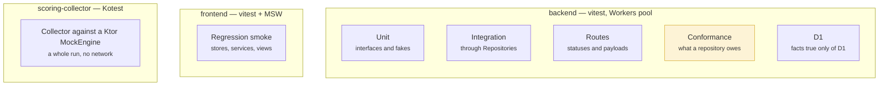

# Test strategy

The backend's testing rule is unusual and worth stating first, because
everything else follows from it: **what separates the tiers is not how much of
the stack they exercise — it is which layer they are allowed to name.**

That rule exists to protect one property. The persistence target must be
replaceable, so a second implementation of the repository interfaces should be
able to run this suite unchanged and have it mean the same thing. A test that
reaches for SQL because it is convenient has quietly made that impossible.

## Three suites, three purposes



Every backend test runs in the Workers pool against a **real D1 database**,
which is dropped and re-migrated before each test. There is no in-memory
substitute and no mocked query builder: the thing under test talks to the thing
that ships.

## The backend tiers

| Where | May name | For |
|---|---|---|
| `tests/**/*.spec.ts` | interfaces, fakes | Unit tests. No database at all. |
| `tests/integration/` | services, `Repositories` | The rules a caller sees |
| `tests/routes/` | routers, `Repositories` | Statuses, payload shapes, and what never leaves |
| `tests/repositories/conformance/` | `Repositories`, nothing below | **The gate a second implementation must pass** |
| `tests/repositories/d1/` | `*RepositoryD1`, SQL, `env.db` | Facts that are true of D1 alone |
| `tests/support/` | `Repositories` (D1 only under `support/d1/`) | The seam and the fixtures |

The conformance tier is the interesting one. It is written against the
interfaces and nothing below them, which makes it a portable specification: point
`tests/support/target.ts` at another implementation and the same file becomes
that implementation's acceptance criteria.

**The rule is enforced, not trusted.** `no-restricted-imports` forbids anything
under `services/`, `routes/` or `tests/` from importing `repositories/d1/**`,
with the two directories whose purpose *is* naming D1 exempted by name. Lint
catches the erosion that code review eventually stops catching.

→ [Backend Testing](../docs/development/backend-testing.md) — the canonical rules

## Seeding

Through the interfaces, never with SQL, and never with defaulted fixture values.
`tests/support/subjects.ts` holds the helpers — `aPlayer()`, `aTeamIn(leagueId)`,
`aLeague(league, foundingTeamName)` — and the last one takes a whole `NewLeague`
so that a test says everything a production caller says.

The reason to ban defaults is specific: a fixture that quietly fills in a field
is a test that passes for a reason the test does not state, and it keeps passing
after the field starts mattering.

## Two constraints the Workers pool imposes

Both were found the hard way and are worth knowing before writing a backend test:

- **`vi.mock` silently does nothing.** A test that appears to stub a module is
  testing the real one. Substitute through the constructor instead — which is
  why services take their dependencies that way.
- **A `WorkflowEntrypoint` cannot be constructed in a test.** The settlement
  logic therefore lives in a service the Workflow calls, not in the entrypoint,
  and the service is what the tests drive.

## The frontend, deliberately looser

Frontend specs are regression smoke. They cover the stores, the services and a
handful of views, and they exist to catch a refactor that breaks rendering —
not to re-assert the game's rules. Those are tested where they are implemented.

Duplicating a rule into the browser suite would mean two places to change every
time the rule moves, and the second one would be found late, by a red build
nobody expected.

Two specifics that repeatedly cost time:

- **Route guards get their own spec.** Testing a `beforeEnter` by mounting the
  page gives the guard a different Pinia instance and quietly tests nothing.
- **A page that watches its route must be unmounted**, or the suite hangs.

MSW backs every test with `onUnhandledRequest: "error"`, so a request no handler
expects fails the test rather than escaping to the network.

## What the coverage figures do and do not say

[The coverage board](../index.md#coverage) reports line coverage for all three
suites. Two things about it are worth stating, because both are routinely
assumed the other way.

**A covered line is a line some test caused to execute.** It is not a line whose
behaviour anyone asserted. A suite can push the figure up by importing modules
and never checking their output; what stops that here is the seeding rule above
and the habit of reviewing for it, not the percentage.

**The three figures are not comparable with one another.** The backend excludes
its route modules from the report on purpose — routes are exercised end to end by
the integration tier, which drives them over real HTTP, and counting them twice
would flatter the number. The frontend is the lowest of the three and is expected
to be, for the reason in the section above. The Kotlin collector counts
everything it has, including the Wikimedia response parsing that carries most of
its risk.

## Running them

```bash
./gradlew check            # everything: format, lint, test, audit, both packages

cd backend && npm test     # the Workers-pool suite
cd backend && npm run test-coverage
cd frontend && npm test
cd frontend && npm run hot-test

npx vitest run src/tests/auth/LoginPage.spec.ts   # one file
```

`./gradlew check` is what CI runs, and it is the definition of "green". Anything
that passes locally but not there is a difference in the environment, not in the
tests.

## Related

- [About this site](../about-this-site.md) — how the coverage board's numbers are
  produced
- [Continuous delivery](./ci-cd.md) — where these suites run
- [Backend Testing](../docs/development/backend-testing.md)
- [Architecture overview](../architecture/) — the seams the tiers are drawn around
