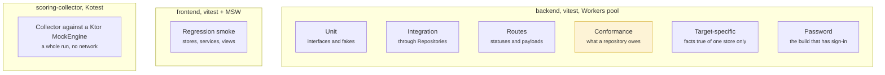

# Test strategy

The backend's testing rule is unusual and worth stating first, because
everything else follows from it: **what separates the tiers is not how much of
the stack they exercise; it is which layer they are allowed to name.**

That rule exists to protect one property. The persistence target must be
replaceable, so a second implementation of the repository interfaces should be
able to run this suite unchanged and have it mean the same thing. A test that
reaches for a query because it is convenient has quietly made that impossible.

This is no longer a promise the suite makes about a hypothetical target. There
are two, D1 and MongoDB, and `./gradlew check` runs the same files against
both.

## Three suites, three purposes



Every backend test runs in the Workers pool against a **real database**, reset
before each test, every collection emptied and the baseline re-seeded on
MongoDB, the schema dropped and the migrations replayed on D1. There is no
in-memory substitute and no mocked query builder: the thing under test talks to
the thing that ships.

The two runs are the same files. `npm test` runs them against D1 and
`npm run testmongo` against MongoDB, and the seam between them is a single test
module, `tests/support/target.ts`, which reads the same `PERSISTENCE` binding
production reads, through the same composition root. The suite therefore cannot
be pointed at a combination a deployment could not also be. Locally
`./gradlew check` runs the two one after the other; in CI they are the two legs
of a matrix, on separate runners, each reporting on its own
([Continuous delivery](./ci-cd.md)).

The Mongo run starts a **single-node replica set** of its own, because the
guarded writes are multi-document transactions and a standalone server refuses
them. Starting it rather than requiring one is what lets `./gradlew check` run
both targets on any machine, with nothing installed and no service to remember
to start.

## The backend tiers

| Where | May name | For |
|---|---|---|
| `tests/**/*.spec.ts` | interfaces, fakes | Unit tests. No database at all. |
| `tests/integration/` | services, `Repositories` | The rules a caller sees |
| `tests/routes/` | routers, `Repositories` | Statuses, payload shapes, and what never leaves |
| `tests/repositories/conformance/` | `Repositories`, nothing below | **The gate a second implementation must pass** |
| `tests/repositories/d1/` | `*RepositoryD1`, SQL, `env.db` | Facts that are true of D1 alone |
| `*.password.test.ts` | `credentials()`, `src/indexPassword.ts` | Username/password sign-in, which only one build has |
| `tests/support/` | `Repositories` (a target only under `support/<target>/`) | The seam and the fixtures |

The conformance tier is the interesting one. It is written against the
interfaces and nothing below them, which makes it a portable specification: point
`tests/support/target.ts` at another implementation and the same file becomes
that implementation's acceptance criteria.

**The rule is enforced, not trusted.** `no-restricted-imports` forbids anything
under `services/`, `routes/` or `tests/` from importing `repositories/d1/**` or
`repositories/mongo/**`, with the directories whose purpose *is* naming a target
exempted by name. Lint catches the erosion that code review eventually stops
catching.

Two tiers are collected by one run and not the other, and for different
reasons. The **target-specific** tier is about a store: an inlined literal in a
view, a `NOT NULL` that provokes a rollback, an empty `IN ()`, none of them
questions to put to a document database, so the Mongo run skips them. The
**password** tier is about a *build*: only the MongoDB entry module mounts
username/password sign-in, and the deployed Worker does not contain that code
at all, so only the Mongo run has anything to run.

→ [Backend Testing](../docs/development/backend-testing.md): the canonical
rules · [Auth Modes](../docs/architecture/auth-modes.md): why one build has a
route the other does not

## Seeding

Through the interfaces, never with a query, and never with defaulted fixture
values. `tests/support/subjects.ts` holds the helpers, `aPlayer()`,
`aTeamIn(leagueId)`, `aLeague(league, foundingTeamName)`, and the last one
takes a whole `NewLeague` so that a test says everything a production caller
says.

The reason to ban defaults is specific: a fixture that quietly fills in a field
is a test that passes for a reason the test does not state, and it keeps passing
after the field starts mattering.

## Two constraints the Workers pool imposes

Both were found the hard way and are worth knowing before writing a backend test:

- **`vi.mock` silently does nothing.** A test that appears to stub a module is
  testing the real one. Substitute through the constructor instead, which is
  why services take their dependencies that way.
- **A `WorkflowEntrypoint` cannot be constructed in a test.** The settlement
  logic therefore lives in a service the Workflow calls, not in the entrypoint,
  and the service is what the tests drive.

## The frontend, deliberately looser

Frontend specs are regression smoke. They cover the stores, the services and a
handful of views, and they exist to catch a refactor that breaks rendering,
not to re-assert the game's rules. Those are tested where they are implemented.

Duplicating a rule into the browser suite would mean two places to change every
time the rule moves, and the second one would be found late, by a red build
nobody expected.

Two specifics that repeatedly cost time:

- **Route guards get their own spec.** Testing a `beforeEnter` by mounting the
  page gives the guard a different Pinia instance and quietly tests nothing.
- **A page that watches its route must be unmounted**, or the suite hangs.

MSW backs every test with `onUnhandledRequest: "error"`, so a request no handler
expects fails the test rather than escaping to the network.

→ [Frontend Testing](../docs/development/frontend-testing.md): what every mount
already has, how to stub one response, and where a test goes

## No end-to-end suite, and what stands in for it

There is no browser-driven end-to-end suite, and that is a decision rather than
an omission. It is worth being exact about what it leaves untested, because
most of what an end-to-end suite would check is already checked closer to where
it can break:

| Seam | Checked by |
|---|---|
| A rule, against a real database | The backend suite, on both persistence targets |
| A route's statuses and payloads, over HTTP, in the Workers runtime | The routes tier |
| The backend's routes against what the frontend is told they are | `openapi.spec.ts`, in both directions |
| A screen, against those payloads | The frontend suite, through MSW |
| The collector, against Wikimedia's and the backend's responses | The Kotlin suite, through a mock HTTP engine |

**What none of them covers** is the real browser talking to the real Worker over
the real network: a cookie a browser refuses, a proxy that drops a header, a
page that renders against a live response nobody mocked. That seam was tested
by the only thing that can test it completely, which is people playing on
production. [The playtest](./playtest.md) ran for 35 days with thirteen players,
and what it found is recorded there.

The trade-off is stated plainly: a regression in that seam is found by a
player, or by an author on the `dev` preview environment, rather than by CI. An
end-to-end suite would move that discovery earlier at the price of the slowest
and flakiest tier there is, run against a Worker and a database that would have
to be stood up per run. For a game of friends' leagues that ships from one
commit to one environment, that price was judged not worth it.

## The figures, and what they say

<CoverageBoard />

Measured on `master` at `3680074`, 2026-09-18, from the CI run's own reports:

| Suite | Lines | Branches |
|---|---|---|
| Backend (D1 leg) | 64.8% | 65.0% |
| Frontend | 76.2% | 67.4% |
| Scoring collector | 88.3% | 56.7% |

**The backend figure understates the backend.** Of its 651 uncovered lines, 370
are the MongoDB repositories and 157 are test helpers that only the Mongo leg
runs, and the Mongo leg is not instrumented: coverage comes from the D1 leg
alone. Leave those two out and about 90% of the lines on the D1 path execute.
Instrumenting the Mongo leg and merging the two reports is the change that
would make the number mean what it looks like it means.

**The collector's branches are the weakest figure here, and they are in one
place.** 64 of its 84 uncovered branches are in `WikimediaClient.kt`, the client
for the one upstream the project does not control, and 22 of its 26 uncovered
lines are `Main.kt`, the entry point, which no test runs. The first is where
the next collector test belongs.

## How to read the coverage figures

The board reports line coverage for all three suites. Two things about it are
worth stating, because both are routinely assumed the other way.

**A covered line is a line some test caused to execute.** It is not a line whose
behaviour anyone asserted. A suite can push the figure up by importing modules
and never checking their output; what stops that here is the seeding rule above
and the habit of reviewing for it, not the percentage.

**The three figures are not comparable with one another.** The backend excludes
its route modules from the report on purpose: routes are exercised end to end by
the integration tier, which drives them over real HTTP, and counting them twice
would flatter the number. The frontend's figure should be read with the first
point above in mind: its specs are regression smoke, and mounting a view
executes code that no assertion checks. The Kotlin
collector counts everything it has, including the Wikimedia response parsing
that carries most of its risk.

## Running them

```bash
./gradlew check            # everything: format, lint, test, audit, both targets

cd backend && npm test         # the Workers-pool suite, against D1
cd backend && npm run testmongo # the same files, against MongoDB
cd backend && npm run test-coverage
cd frontend && npm test
cd frontend && npm run hot-test

npx vitest run src/tests/auth/LoginPage.spec.ts   # one file
```

`./gradlew check` is what CI runs, and it is the definition of "green". Anything
that passes locally but not there is a difference in the environment, not in the
tests.

## Related

- [The playtest](./playtest.md): the tier no suite can stand in for: real players, on production
- [About this site](../about-this-site.md): how the coverage board's numbers are
  produced
- [Continuous delivery](./ci-cd.md): where these suites run
- [Backend Testing](../docs/development/backend-testing.md)
- [Frontend Testing](../docs/development/frontend-testing.md)
- [Architecture overview](../architecture/): the seams the tiers are drawn around
